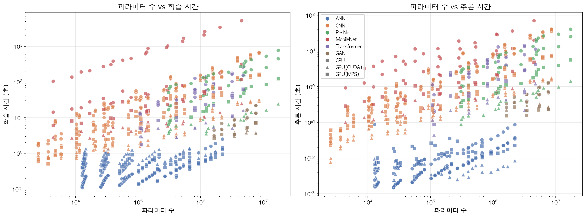
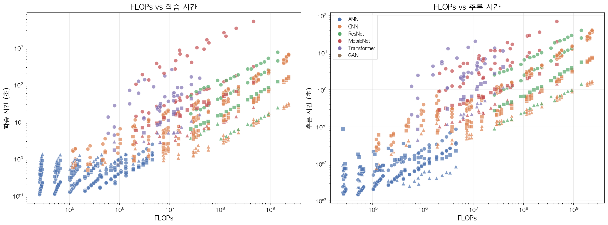
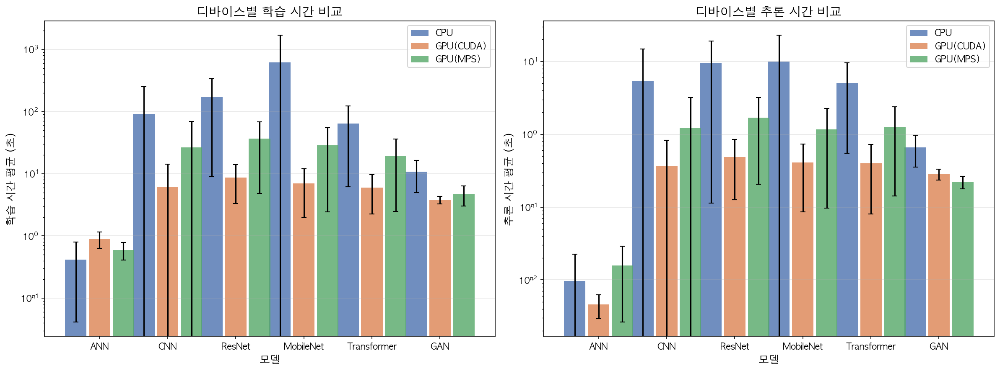
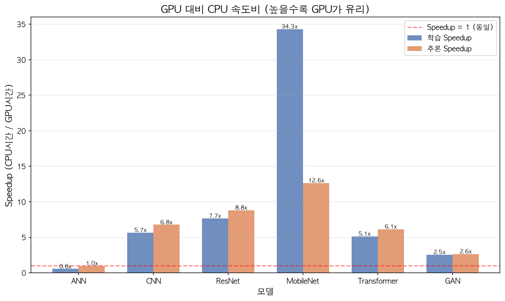
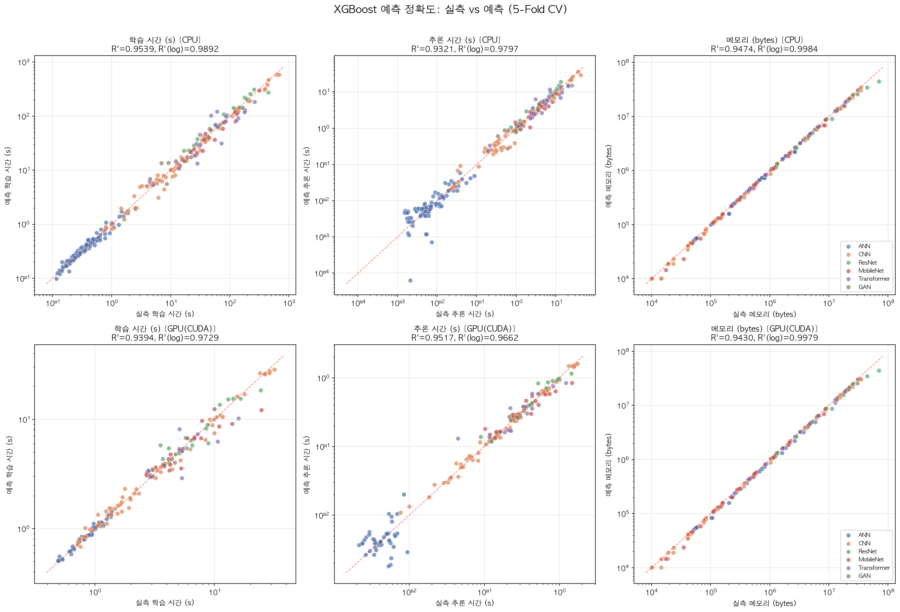
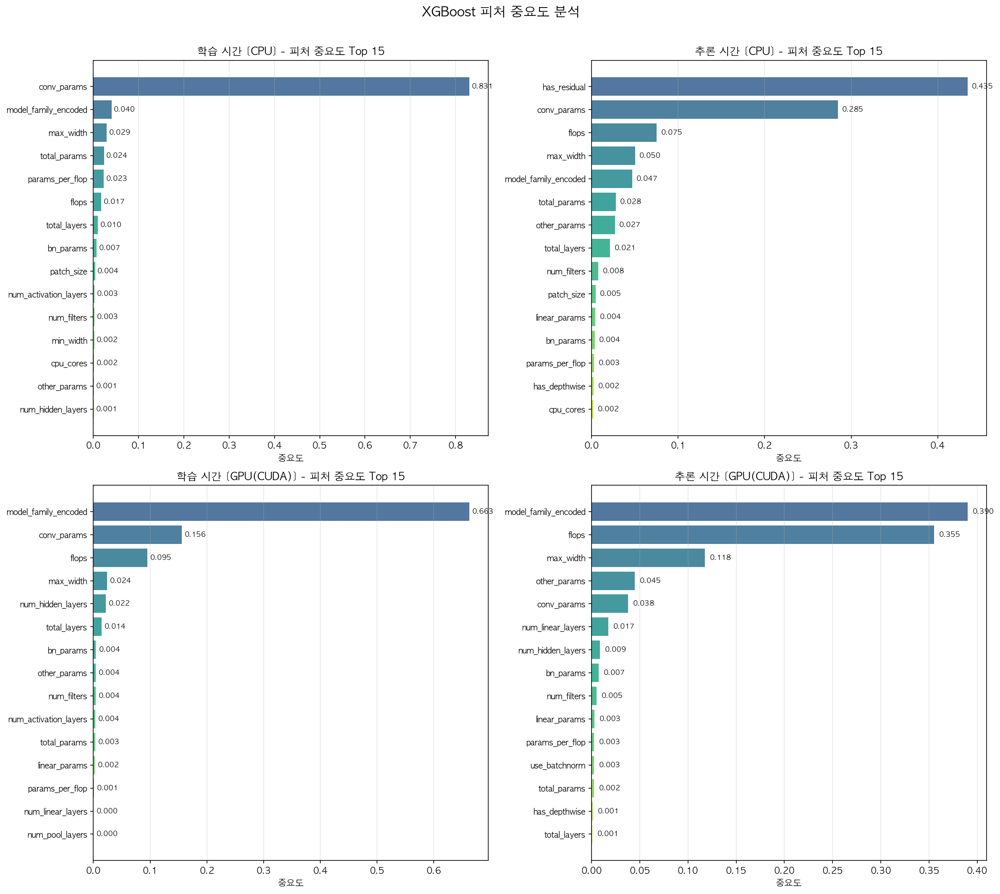
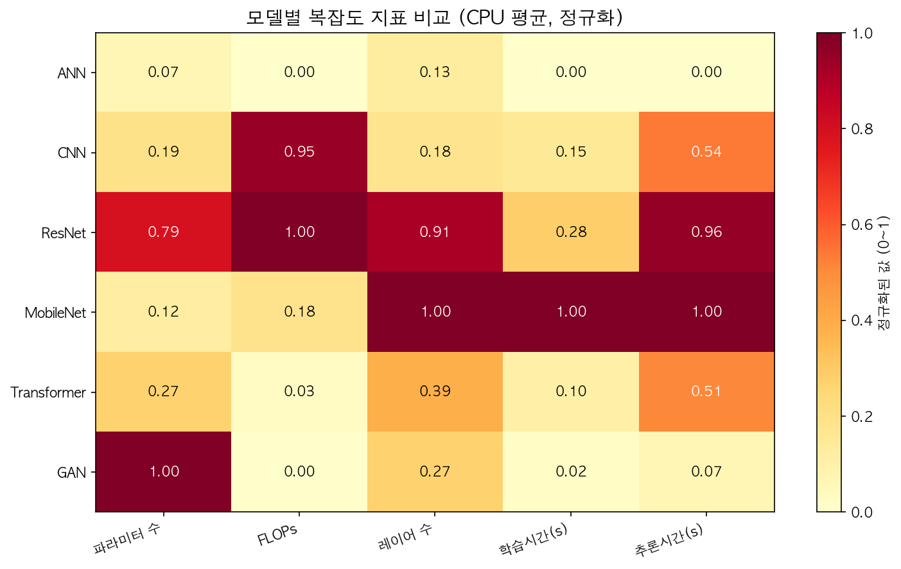

# DNN 실행 시간/공간 예측 시뮬레이션 프레임워크

PyTorch 기반 DNN 모델의 **실행 시간(학습/추론)** 및 **메모리 요구량**을 예측하는 벤치마크 프레임워크입니다.
6종의 모델 아키텍처(ANN, CNN, ResNet, MobileNet, Transformer, GAN)를 벤치마킹하고, **45개 모델 구조 + 하드웨어 피처**로부터 실행 시간을 예측하는 ML 회귀 모델을 학습합니다. 멀티 플랫폼(Windows/macOS/Linux) 하드웨어 자동 감지를 지원합니다.

## 실험 결과 요약

### 벤치마크 데이터 (698개 샘플, 2개 플랫폼)

#### Desktop — Windows (378개 샘플)

| 모델 | 설정 수 | 디바이스 | 파라미터 범위 | 학습시간(s) | 추론시간(s) |
|---|---|---|---|---|---|
| ANN | 84 | CPU, CUDA | 12K ~ 2.2M | 0.24 ~ 2.53 | 0.002 ~ 0.086 |
| CNN | 120 | CPU, CUDA | 2.5K ~ 8.6M | 0.72 ~ 686.5 | 0.008 ~ 41.7 |
| ResNet | 36 | CPU, CUDA | 309K ~ 17.4M | 3.54 ~ 451.0 | 0.090 ~ 25.5 |
| MobileNet | 40 | CPU, CUDA | 4.4K ~ 4.6M | 2.70 ~ 315.4 | 0.103 ~ 19.9 |
| Transformer | 34 | CPU, CUDA | 108K ~ 4.8M | 2.78 ~ 263.0 | 0.045 ~ 20.5 |
| GAN | 16 | CPU, CUDA | 1.7M ~ 7.7M | 3.05 ~ 22.1 | 0.215 ~ 1.32 |

> 측정 환경: AMD Ryzen 7 7800X3D 8C16T, 31GB RAM, NVIDIA RTX 4060 Ti (CUDA)
> 반복: 3회, PyTorch (MKLDNN 활성화)

#### macOS — Apple Silicon (320개 샘플)

| 모델 | 설정 수 | 디바이스 | 파라미터 범위 | 학습시간(s) | 추론시간(s) |
|---|---|---|---|---|---|
| ANN | 84 | CPU, MPS | 12.7K ~ 2.2M | 0.11 ~ 1.30 | 0.002 ~ 0.088 |
| CNN | 120 | CPU, MPS | 2.5K ~ 8.6M | 0.51 ~ 673.7 | 0.028 ~ 40.3 |
| ResNet | 36 | CPU, MPS | 308K ~ 17.4M | 6.48 ~ 771.8 | 0.276 ~ 40.5 |
| MobileNet | 40 | CPU, MPS | 4.4K ~ 4.6M | 5.98 ~ 5289.5 | 0.290 ~ 71.3 |
| Transformer | 24 | CPU, MPS | 108K ~ 4.8M | 1.74 ~ 154.5 | 0.086 ~ 11.4 |
| GAN | 16 | CPU, MPS | 1.7M ~ 7.7M | 2.59 ~ 13.4 | 0.154 ~ 0.725 |

> 측정 환경: Apple M4 (4P+6E 10코어), 24GB 통합 메모리, MPS (Metal Performance Shaders)
> 반복: 3회 (ANN/CNN/ResNet/MobileNet CPU는 기존 10회 측정치 활용), PyTorch (MKLDNN 비활성화)

#### 크로스 플랫폼 비교

| 비교 항목 | ANN | CNN | ResNet | MobileNet | Transformer | GAN |
|---|---|---|---|---|---|---|
| Mac CPU / Desktop CPU | 0.9x | 1.9x | 2.5x | **14.0x** | 0.8x | 0.6x |
| MPS Speedup (Mac GPU/CPU) | 0.5x | 5.1x | 7.1x | **35.0x** | 2.7x | 1.7x |

> **주요 발견**: MobileNet의 depthwise separable convolution은 Mac ARM CPU에서 14배 느림 (PyTorch ARM 빌드에 MKLDNN/oneDNN 미포함으로 depthwise conv 전용 최적화 커널 부재). 반면 MPS(GPU)에서는 35배 가속되어 정상 성능 발휘. ANN은 두 플랫폼 모두에서 GPU 오버헤드로 인해 CPU가 더 빠름.

### 예측 모델 성능 (XGBoost, 5-Fold CV) — Desktop 데이터 기준

| 예측 타겟 | 디바이스 | R² | R²(log) | RMSE | MAE |
|---|---|---|---|---|---|
| 학습 시간 | CPU | 0.9465 | **0.9865** | 25.354s | 10.103s |
| 학습 시간 | CUDA | 0.9391 | **0.9724** | 1.561s | 0.663s |
| 추론 시간 | CPU | 0.9345 | **0.9772** | 1.686s | 0.642s |
| 추론 시간 | CUDA | 0.9520 | **0.9659** | 0.084s | 0.038s |
| 메모리 | CPU | 0.9445 | **0.9974** | 2.2MB | 0.4MB |
| 메모리 | CUDA | 0.9430 | **0.9979** | 2.3MB | 0.5MB |

> Mac (MPS) 예측 모델은 벤치마크 완료 후 학습 예정

## 시각화 결과

### 1. 파라미터 수 vs 실행 시간



파라미터 수와 실행 시간의 관계를 모델별(색상)·디바이스별(마커)로 표시. CNN/ResNet은 파라미터 증가에 따라 시간이 급증하며, ANN은 상대적으로 변동이 작다.

### 2. FLOPs vs 실행 시간



연산량(FLOPs)과 실행 시간의 상관관계. FLOPs가 높을수록 시간이 증가하며, 같은 FLOPs에서도 모델 구조에 따라 실행 시간이 달라진다 (메모리 접근 패턴, 병렬화 효율 차이).

### 3. CPU vs GPU 디바이스별 비교



6종 모델의 CPU/GPU 학습·추론 시간 비교. ResNet, CNN, Transformer에서 GPU 가속 효과가 크고, ANN에서는 GPU 오버헤드로 CPU가 오히려 빠르다.

### 4. GPU Speedup 비율



GPU 대비 CPU 속도비. CNN(13.8x), Transformer(12.3x), ResNet(13.0x)은 GPU 가속 효과가 크지만, **ANN은 0.7x로 GPU가 오히려 느림** (모델이 작아 GPU 커널 오버헤드가 지배적).

### 5. 예측 정확도 (실측 vs 예측)



XGBoost 5-Fold CV 예측 결과. 대각선(완벽한 예측)에 데이터가 밀착되어 있으며, 학습시간·추론시간·메모리 모두 R²(log) 0.97~0.99 수준의 높은 정확도를 달성.

### 6. 피처 중요도 (Top 15)



XGBoost 기준 피처 중요도 분석 결과:
- **학습 시간**: `model_family_encoded`(모델 종류)와 `conv_params`(Conv 파라미터)가 지배적
- **추론 시간 (CPU)**: `has_residual`(잔차 연결 유무)이 0.52로 압도적. 추론 시 skip-connection이 추가 연산 유발
- **추론 시간 (CUDA)**: `model_family_encoded`(0.38) + `flops`(0.29)로 연산량이 핵심
- **메모리**: `total_params`(0.99+)가 거의 단독으로 결정

### 7. 모델별 복잡도 히트맵



CPU 평균 기준 정규화 비교. ResNet이 파라미터·FLOPs·레이어·실행시간 전 지표에서 최대이며, GAN은 파라미터가 많지만 FLOPs는 낮아 학습 시간도 상대적으로 짧다.

## 팀원별 기여 (3개 브랜치 병합)

### ijunsoo - 기본 프레임워크 설계 + 모듈형 구조

- **벤치마크 프레임워크 재설계**: 단일 스크립트(`ann.py`, `cnn.py`) 구조에서 `benchmark/` 패키지 기반 모듈형 구조로 전환
- **모델 레지스트리** (`benchmark/models/registry.py`): 데코레이터 기반 모델 팩토리 패턴으로 모델 등록/생성 통합
- **CNN 파라미터 역전 수정**: `AdaptiveAvgPool2d((1,1))` 도입으로 레이어 증가 시 파라미터가 오히려 줄어드는 문제 해결
- **4종 기본 모델**: SimpleANN, SimpleCNN, ResNet-MNIST, MobileNet-MNIST 구현
- **설정 자동 생성** (`benchmark/configs/generator.py`): 모델별 하이퍼파라미터 조합 자동 생성 (160개 config)
- **장치 관리 / 데이터 로딩 / 실험 루프**: `benchmark/runner/` 패키지로 분리하여 재사용 가능한 구조
- **피처 추출기** (`benchmark/features/extractor.py`): PyTorch 모델에서 구조 피처 자동 추출 (Forward hook 기반 FLOPs 계산 포함)

### dal-merge (달현) - XGBoost + GridSearchCV + 하드웨어 피처

- **XGBoost 회귀 모델 도입**: RandomForest/GradientBoosting 외에 XGBoost + GridSearchCV로 최적 하이퍼파라미터 자동 탐색
- **log1p 변환**: 실행 시간의 넓은 범위(ms~수백초)를 `log1p`/`expm1`으로 안정화하여 예측 정확도 향상
- **하드웨어 피처 통합**: CPU 코어 수, 클럭 주파수, RAM, GPU 메모리를 피처에 추가 (`psutil` 활용)
- **장치별 별도 모델 학습**: CPU와 GPU의 실행 시간 패턴이 다르므로 장치별 분리 학습
- **R²(log) 메트릭 추가**: log 공간에서의 결정계수를 별도 평가하여 전 구간 예측 성능 확인

### khg9859 (홍근) - Transformer/GAN + ONNX + Op-Level 프로파일링

- **Transformer (Vision Transformer)** 모델 추가 (`benchmark/models/transformer.py`): PatchEmbedding, MultiHeadAttention, TransformerEncoderBlock 직접 구현, CIFAR-10 대응
- **GAN (Generator + Discriminator)** 모델 추가 (`benchmark/models/gan.py`): 적대적 학습 벤치마크 지원
- **ONNX 파이프라인**: `export_onnx.py`(PyTorch->ONNX 변환) + `predict_from_onnx.py`(ONNX->피처추출->시간예측)
- **ONNX 피처 추출기** (`benchmark/features/onnx_extractor.py`): ONNX 그래프에서 가중치 shape 기반 FLOPs 직접 계산
- **joblib 모델 저장/로딩**: 학습된 예측 모델을 저장하여 재사용 (`--save-models`)
- **Op-Level 프로파일러** (`benchmark/features/op_profiler.py`): 모델을 개별 연산 단위로 분해하여 시간/메모리 측정하여 합산 시뮬레이션
- **Transformer Attention FLOPs 보정**: `nn.Linear` hook으로 잡히지 않는 Q@K, attn@V matmul FLOPs를 별도 추정

## 교수님 연구 방향 대응

| 연구 요구사항 | 구현 | 파일 |
|---|---|---|
| DNN 추론 시간/공간 예측 시뮬레이션 | 학습시간 + 추론시간 + 메모리 3가지 타겟 예측 | `train_predictor.py` |
| DNN 시간 추정 모델 타당성 검증 | 4개 ML 모델 x K-Fold CV x GridSearchCV | `train_predictor.py` |
| 다양한 모델에 적용 | 6종 (ANN, CNN, ResNet, MobileNet, Transformer, GAN) | `benchmark/models/` |
| 모델을 작은 연산 단위로 분해하여 예측 | Op-level 분해 -> 개별 시간 측정 -> 합산 시뮬레이션 | `benchmark/features/op_profiler.py` |
| ONNX 표준 형식 모델 실행 시간 추론 | ONNX export -> 피처 추출 -> 학습된 모델로 예측 | `export_onnx.py`, `predict_from_onnx.py` |

## 프로젝트 구조

```
ann/
├── benchmark/                          # 메인 패키지
│   ├── models/                         # 모델 정의
│   │   ├── registry.py                 # 모델 팩토리 레지스트리
│   │   ├── simple_ann.py               # SimpleANN (MNIST)
│   │   ├── simple_cnn.py              # SimpleCNN (MNIST, AdaptiveAvgPool2d 적용)
│   │   ├── resnet_mnist.py            # ResNet (MNIST)
│   │   ├── mobilenet_mnist.py         # MobileNet (MNIST)
│   │   ├── transformer.py            # Vision Transformer (CIFAR-10)
│   │   └── gan.py                     # GAN Generator+Discriminator (CIFAR-10)
│   ├── features/                       # 피처 추출
│   │   ├── extractor.py               # PyTorch 모델 -> 49개 구조 피처
│   │   ├── onnx_extractor.py          # ONNX 파일 -> 구조 피처
│   │   └── op_profiler.py             # Op-level 분해/시간 측정/시뮬레이션
│   ├── runner/                         # 실험 실행
│   │   ├── device.py                  # 장치 감지/동기화/워밍업
│   │   ├── data.py                    # MNIST + CIFAR-10 데이터 로딩
│   │   └── experiment.py              # 학습/추론/GAN 시간 측정 루프
│   ├── configs/
│   │   └── generator.py               # 160개 설정 조합 자동 생성
│   └── results/
│       └── io.py                       # JSON 증분 저장/CSV 변환
├── run_benchmark.py                    # 통합 벤치마크 실행 진입점
├── train_predictor.py                  # 예측 모델 학습 (LR/RF/GB/XGBoost)
├── visualize_results.py                # 시각화 (9종 그래프 생성)
├── export_onnx.py                      # PyTorch -> ONNX 변환
├── predict_from_onnx.py                # ONNX -> 실행 시간 예측
├── results/
│   ├── benchmark_results.json          # Desktop 벤치마크 데이터 (378개, CPU+CUDA)
│   ├── benchmark_results_mac.json      # Mac 벤치마크 데이터 (320개, CPU+MPS)
│   ├── figures/                        # 시각화 그래프 (9개)
│   └── trained_models/                 # 학습된 예측 모델 (.pkl)
└── requirements.txt
```

## 설치

```bash
python -m venv .venv
source .venv/bin/activate       # Mac/Linux
# .venv\Scripts\activate        # Windows
pip install -r requirements.txt
```

### 의존성

```
torch, torchvision, numpy, scikit-learn, xgboost, onnx, joblib, psutil, matplotlib
```

## 사용법

### 1. 벤치마크 실행

```bash
# 전체 실행 (6종 모델 x 160개 설정 x 3회 반복)
python run_benchmark.py --repeats 3

# 특정 모델만 실행
python run_benchmark.py --model simple_ann
python run_benchmark.py --model transformer
python run_benchmark.py --model gan

# 빠른 테스트 (3회 반복, CPU만)
python run_benchmark.py --repeats 3 --device cpu

# Op-level 프로파일링 포함
python run_benchmark.py --profile-ops

# 중단 후 이어서 실행
python run_benchmark.py --resume
```

### 2. 예측 모델 학습

```bash
# 기본 실행 (5-fold CV)
python train_predictor.py

# 10-fold CV + 모델 저장
python train_predictor.py --cv 10 --save-models
```

**예측 타겟 3가지**: 학습 시간, 추론 시간, 메모리 요구량
**ML 모델 4가지**: LinearRegression, RandomForest+GridSearchCV, GradientBoosting, XGBoost+GridSearchCV

### 3. 시각화

```bash
python visualize_results.py
# 결과: results/figures/ 에 9개 그래프 생성
# Mac 데이터 포함 시 크로스 플랫폼 비교 그래프도 자동 생성
python visualize_results.py --input-mac results/benchmark_results_mac.json
```

| 그래프 | 설명 |
|---|---|
| fig1_params_vs_time | 파라미터 수 vs 학습/추론 시간 산점도 |
| fig2_flops_vs_time | FLOPs vs 학습/추론 시간 산점도 |
| fig3_device_comparison | CPU vs GPU 디바이스별 막대 그래프 |
| fig4_speedup_ratio | GPU Speedup 비율 (모델별) |
| fig5_prediction_accuracy | 실측 vs 예측 산점도 (XGBoost CV) |
| fig6_feature_importance | 피처 중요도 Top 15 |
| fig7_complexity_heatmap | 모델별 복잡도 지표 히트맵 |
| fig8_cross_platform | 4-플랫폼 (Desktop CPU/CUDA, Mac CPU/MPS) 학습시간 비교 + 성능 비율 |
| fig9_depthwise_penalty | MobileNet Depthwise Conv 페널티: 파라미터 vs 학습시간 (플랫폼별) |

### 4. ONNX 예측 파이프라인

```bash
# 대표 모델을 ONNX로 변환
python export_onnx.py

# ONNX 파일에서 실행 시간 예측
python predict_from_onnx.py --onnx model.onnx --device cpu
python predict_from_onnx.py --demo  # 전체 샘플 예측
```

### 5. Op-Level 프로파일링 (단독 사용)

```python
from benchmark.features.op_profiler import measure_op_times, simulate_total_time, print_op_profile
from benchmark.models.simple_cnn import SimpleCNN

model = SimpleCNN(num_filters=32, num_conv_layers=3)
ops = measure_op_times(model, input_shape=(1, 1, 28, 28), device='cpu')
print_op_profile(ops)

sim = simulate_total_time(ops)
print(f"시뮬레이션 총 시간: {sim['total_time_ms']:.4f}ms")
```

## 통합 Feature Schema (v2.0) — 45개 피처

`extractor.py`가 단일 소스(single source of truth)로 모든 피처를 직접 생성합니다.

### 피처 카테고리 요약

| 카테고리 | 수 | 피처 | 설명 |
|---|---|---|---|
| **파라미터** | 6 | total_params, trainable_params, conv_params, linear_params, bn_params, other_params | 레이어 타입별 파라미터 수 분해 |
| **레이어 수** | 7 | total_layers, num_hidden_layers, num_conv_layers, num_linear_layers, num_bn_layers, num_pool_layers, num_activation_layers | 연산 레이어 구성 |
| **폭** | 4 | max_width, min_width, avg_width, max_channel_width | 레이어 폭/채널 수 통계 |
| **연산량** | 5 | flops, flops_per_sample, params_per_flop, model_size_mb, memory_bytes | 계산 복잡도 + 메모리 |
| **구조 플래그** | 7 | has_residual, has_depthwise, has_attention, has_pooling, has_batch_norm, has_layer_norm, has_dropout | 아키텍처 특성 (0/1) |
| **모델 분류** | 1 | model_family_encoded | 모델 계열 정수 인코딩 (0~5) |
| **모델 전용** | 9 | hidden_size, num_filters, use_batchnorm, embed_dim, num_heads, patch_size, latent_dim, generator_params, discriminator_params | 아키텍처별 고유 하이퍼파라미터 |
| **입력 데이터** | 5 | batch_size, input_height, input_width, input_channels, num_classes | 데이터셋/배치 정보 |
| **하드웨어** | 6 | device_type_encoded, cpu_cores, cpu_freq_ghz, ram_total_gb, gpu_cores, gpu_memory_gb | 실행 환경 사양 (OS 자동 감지) |

### 피처 상세 설명

#### 1. 파라미터 관련 (6개)

| 피처 | 타입 | 단위 | 설명 | 예시 (ResNet-18) |
|---|---|---|---|---|
| `total_params` | int | 개 | 모델 전체 파라미터 수 | 11,173,962 |
| `trainable_params` | int | 개 | 학습 가능한 파라미터 수 (frozen 제외) | 11,173,962 |
| `conv_params` | int | 개 | Conv2d 레이어 파라미터 합계 | 10,950,144 |
| `linear_params` | int | 개 | Linear(FC) 레이어 파라미터 합계 | 5,130 |
| `bn_params` | int | 개 | BatchNorm 레이어 파라미터 합계 | 18,688 |
| `other_params` | int | 개 | 위 3종에 포함되지 않는 파라미터 | 200,000 |

#### 2. 레이어 수 (7개)

| 피처 | 설명 | ANN 예시 | CNN 예시 | Transformer 예시 |
|---|---|---|---|---|
| `total_layers` | Conv + Linear + BN 레이어 총합 | 3 | 12 | 26 |
| `num_hidden_layers` | Conv + Linear 레이어 수 | 3 | 8 | 20 |
| `num_conv_layers` | Conv2d 레이어 수 | 0 | 5 | 0 |
| `num_linear_layers` | Linear(FC) 레이어 수 | 3 | 3 | 20 |
| `num_bn_layers` | BatchNorm 레이어 수 | 0 | 4 | 0 |
| `num_pool_layers` | Pooling(Max/Avg/Adaptive) 레이어 수 | 0 | 2 | 0 |
| `num_activation_layers` | 활성화 함수(ReLU/GELU 등) 수 | 2 | 7 | 12 |

#### 3. 폭 (4개)

| 피처 | 설명 | 예시 |
|---|---|---|
| `max_width` | config 기반 최대 레이어 폭 | ANN hidden_size=512 → 512 |
| `min_width` | config 기반 최소 레이어 폭 | CNN [32,64,128] → 32 |
| `avg_width` | config 기반 평균 레이어 폭 | CNN [32,64,128] → 74.7 |
| `max_channel_width` | 모델 introspection 기반 최대 채널/뉴런 수 | ResNet out_channels=512 → 512 |

#### 4. 연산량 (5개)

| 피처 | 단위 | 설명 | 예시 |
|---|---|---|---|
| `flops` | 회 | Forward hook 기반 FLOPs 추정치 (batch=1) | 37,748,736 |
| `flops_per_sample` | 회 | = flops (batch=1이므로 동일) | 37,748,736 |
| `params_per_flop` | ratio | total_params / flops (파라미터 효율) | 0.296 |
| `model_size_mb` | MB | 모델 파라미터 크기 (FP32 기준) | 42.6 |
| `memory_bytes` | bytes | 파라미터 실제 메모리 점유 | 44,695,848 |

#### 5. 구조 플래그 (7개) — 모두 0 또는 1

| 피처 | =1 조건 | 해당 모델 |
|---|---|---|
| `has_residual` | Skip connection 있음 | ResNet, MobileNet, Transformer |
| `has_depthwise` | Depthwise separable conv 있음 | MobileNet |
| `has_attention` | MultiheadAttention 있음 | Transformer |
| `has_pooling` | Pooling 레이어 있음 | CNN, ResNet, MobileNet |
| `has_batch_norm` | BatchNorm 있음 | CNN, ResNet, MobileNet, GAN |
| `has_layer_norm` | LayerNorm 있음 | Transformer |
| `has_dropout` | Dropout 있음 | (현재 모델에 미사용) |

#### 6. 모델 분류 (1개)

| 값 | 모델 | 데이터셋 |
|---|---|---|
| 0 | simple_ann | MNIST (28×28×1) |
| 1 | simple_cnn | MNIST |
| 2 | resnet_mnist | MNIST |
| 3 | mobilenet_mnist | MNIST |
| 4 | transformer | CIFAR-10 (32×32×3) |
| 5 | gan | CIFAR-10 |

#### 7. 모델 전용 피처 (9개)

| 피처 | 해당 모델 | 설명 | 비해당 시 |
|---|---|---|---|
| `hidden_size` | ANN | FC 레이어 뉴런 수 | 0 |
| `num_filters` | CNN | 첫 번째 Conv 필터 수 | 0 |
| `use_batchnorm` | CNN | BN 사용 여부 (0/1) | 0 |
| `embed_dim` | Transformer | 임베딩 차원 | 0 |
| `num_heads` | Transformer | Attention Head 수 | 0 |
| `patch_size` | Transformer | ViT 패치 크기 | 0 |
| `latent_dim` | GAN | 노이즈 벡터 차원 | 0 |
| `generator_params` | GAN | Generator 실제 파라미터 수 | 0 |
| `discriminator_params` | GAN | Discriminator 실제 파라미터 수 | 0 |

#### 8. 입력 데이터 피처 (5개)

| 피처 | MNIST 모델 | CIFAR-10 모델 |
|---|---|---|
| `batch_size` | 64 | 64 |
| `input_height` | 28 | 32 |
| `input_width` | 28 | 32 |
| `input_channels` | 1 | 3 |
| `num_classes` | 10 | 10 |

#### 9. 하드웨어 피처 (6개) — OS 자동 감지

| 피처 | macOS (Apple Silicon) | Windows (NVIDIA) | 조회 방법 |
|---|---|---|---|
| `device_type_encoded` | 0(CPU) / 2(MPS) | 0(CPU) / 1(CUDA) | `torch.device.type` 매핑 |
| `cpu_cores` | 10 | 16 | `psutil` / `sysctl hw.logicalcpu` |
| `cpu_freq_ghz` | 3.5 | 3.8 | `psutil` / `sysctl` / `wmic` |
| `ram_total_gb` | 24.0 | 31.2 | `psutil` / `sysctl hw.memsize` |
| `gpu_cores` | 10 | 34 (SM) | `system_profiler` / `cuda.get_device_properties` |
| `gpu_memory_gb` | 18.0 (RAM×75%) | 15.6 | 통합 메모리 추정 / `cuda.get_device_properties` |

> **멀티 플랫폼 지원**: psutil이 없어도 macOS는 `sysctl`/`system_profiler`, Windows는 `wmic`으로 자동 fallback합니다.

### 피처 추출 예시 (SimpleANN, hidden_size=256, 3 layers, CPU)

```json
{
  "total_params": 269322, "trainable_params": 269322,
  "conv_params": 0, "linear_params": 269322, "bn_params": 0, "other_params": 0,
  "total_layers": 3, "num_hidden_layers": 3,
  "num_conv_layers": 0, "num_linear_layers": 3,
  "num_bn_layers": 0, "num_pool_layers": 0, "num_activation_layers": 2,
  "max_width": 256, "min_width": 256, "avg_width": 256, "max_channel_width": 256,
  "flops": 538644, "flops_per_sample": 538644, "params_per_flop": 0.5,
  "model_size_mb": 1.028, "memory_bytes": 1077288,
  "has_residual": 0, "has_depthwise": 0, "has_attention": 0,
  "has_pooling": 0, "has_batch_norm": 0, "has_layer_norm": 0, "has_dropout": 0,
  "model_family_encoded": 0,
  "hidden_size": 256, "num_filters": 0, "use_batchnorm": 0,
  "embed_dim": 0, "num_heads": 0, "patch_size": 0,
  "latent_dim": 0, "generator_params": 0, "discriminator_params": 0,
  "batch_size": 64, "input_height": 28, "input_width": 28, "input_channels": 1, "num_classes": 10,
  "device_type_encoded": 0,
  "cpu_cores": 10, "cpu_freq_ghz": 3.5, "ram_total_gb": 24.0,
  "gpu_cores": 0, "gpu_memory_gb": 0.0
}
```

## 핵심 인사이트

### 예측 모델
1. **XGBoost가 최적**: 4가지 ML 모델 중 XGBoost+GridSearchCV가 모든 타겟에서 일관적으로 최고 R²(log) 달성 (0.97~0.99)
2. **LinearRegression은 부적합**: 비선형 관계가 강해서 R²가 음수까지 떨어짐 (CPU 학습시간 -43, GPU 메모리 -7871)
3. **메모리는 파라미터 수로 결정**: `total_params` 피처 중요도 0.99+ (거의 선형 관계)
4. **추론 시간은 CPU/GPU에서 다른 피처가 중요**: CPU는 `has_residual`(잔차 연결), GPU는 `flops`(연산량)가 지배적

### GPU 가속
5. **ANN은 GPU가 오히려 느림**: Desktop CUDA 0.7x, Mac MPS 0.5x — 모델이 너무 작아 GPU 커널 오버헤드가 연산 시간보다 큼
6. **CNN/ResNet은 GPU 가속 효과 큼**: Desktop CUDA 12~14x, Mac MPS 5~7x
7. **MobileNet은 Mac MPS에서 35x 가속**: CPU depthwise conv 병목이 GPU에서 해소 (Desktop CUDA에서는 7x)

### 크로스 플랫폼
8. **PyTorch ARM CPU 빌드의 한계**: MKLDNN(oneDNN) 미포함으로 depthwise separable convolution 전용 커널 부재. MobileNet CPU 학습이 x86 대비 14배 느림
9. **BLAS 연산은 플랫폼 간 동등**: ANN(FC만 사용)은 Apple Accelerate와 MKL이 비슷한 성능 (0.9x). Transformer/GAN(Linear 위주)도 Mac이 오히려 빠름 (0.6~0.8x)
10. **연산 종류가 플랫폼 성능 격차를 결정**: 같은 모델이라도 depthwise conv 비중에 따라 1배~14배까지 격차 발생
