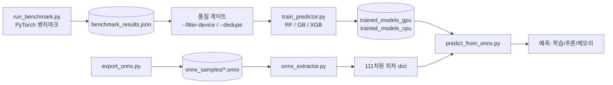
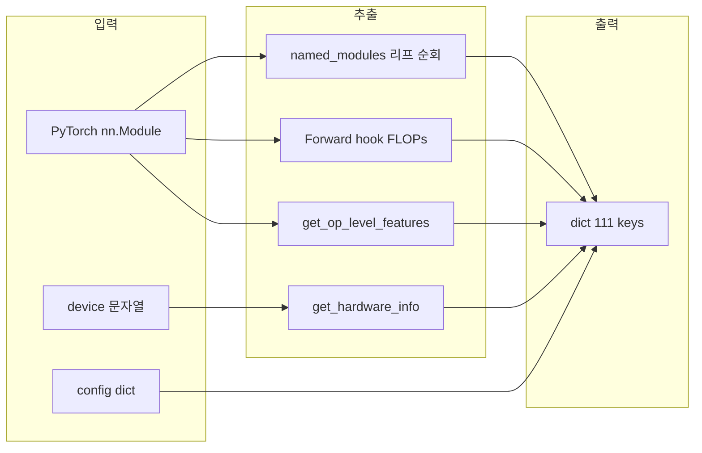

# DNN 실행 시간 예측 메타모델 — 통합 연구 보고서

**작성**: 김홍근, 이준수, 김달현 (iSysLab 학부연구)  
**소속**: iSysLab — AI 프로세서 SW 프레임워크 / 4세부 통합 시뮬레이터  
**브랜치 기준**: `final` (`hong-0311` + `dal-merge` + `ijunsoo` 통합)  
**피처 스키마**: v2.0 (111차원)  
**최종 개정**: 2026-04

---

## 목차

- [1. 서론](#1-서론)
  - [1.1 배경과 동기](#11-배경과-동기)
  - [1.2 연구 목표](#12-연구-목표)
  - [1.3 접근 방법](#13-접근-방법)
- [2. 시스템 구조](#2-시스템-구조)
  - [2.1 파이프라인 개요](#21-파이프라인-개요)
  - [2.2 저장소 구조](#22-저장소-구조)
  - [2.3 진입 스크립트](#23-진입-스크립트)
- [3. 벤치마크 데이터](#3-벤치마크-데이터)
  - [3.1 160 configuration](#31-160-configuration)
  - [3.2 측정 프로토콜](#32-측정-프로토콜)
  - [3.3 품질 게이트](#33-품질-게이트)
  - [3.4 실험 환경 기록](#34-실험-환경-기록)
- [4. 피처 스키마 v2.0 (111차원)](#4-피처-스키마-v20-111차원)
  - [4.1 구성 요약](#41-구성-요약)
  - [4.2 추출 파이프라인](#42-추출-파이프라인)
  - [4.3 그룹 A — 공통 모델 구조 (33)](#43-그룹-a--공통-모델-구조-33)
  - [4.4 그룹 B — 모델 전용 (18)](#44-그룹-b--모델-전용-18)
  - [4.5 그룹 C — 입력 데이터 (8)](#45-그룹-c--입력-데이터-8)
  - [4.6 그룹 D — 하드웨어 (33)](#46-그룹-d--하드웨어-33)
  - [4.7 그룹 E — Op-level 분해 (19)](#47-그룹-e--op-level-분해-19)
  - [4.8 예측 타깃](#48-예측-타깃)
- [5. 메타모델 학습](#5-메타모델-학습)
  - [5.1 학습 프로토콜](#51-학습-프로토콜)
  - [5.2 성능 결과 (5-Fold CV)](#52-성능-결과-5-fold-cv)
  - [5.3 해석](#53-해석)
- [6. 피처 중요도 분석](#6-피처-중요도-분석)
- [7. ONNX 예측 경로](#7-onnx-예측-경로)
  - [7.1 흐름](#71-흐름)
  - [7.2 YAML 메타데이터 스키마 (초안)](#72-yaml-메타데이터-스키마-초안)
  - [7.3 ONNX 예측 vs 벤치마크 비교](#73-onnx-예측-vs-벤치마크-비교)
- [8. 시각화 결과 (fig1~fig7)](#8-시각화-결과-fig1fig7)
- [9. 한계 및 향후 과제](#9-한계-및-향후-과제)
- [10. 과거 단계(Stage 1~5) 이력](#10-과거-단계stage-15-이력)
- [11. 브랜치 통합 이력](#11-브랜치-통합-이력)
- [12. 재현 절차](#12-재현-절차)
- [13. 빠른 시작 (Onboarding)](#13-빠른-시작-onboarding)
- [14. 용어 정리](#14-용어-정리)
- [부록 A. 자주 나는 실수 / 트러블슈팅](#부록-a-자주-나는-실수--트러블슈팅)
- [부록 B. 커밋 컨벤션 및 AI 사용 고지](#부록-b-커밋-컨벤션-및-ai-사용-고지)

---

## 1. 서론

### 1.1 배경과 동기

딥러닝 모델을 실제 배포 전에 "이 구성은 너무 느린가?", "GPU 없이도 가능할까?"와 같은 질문에 답하려면 보통 **직접 돌려 본다**. 하지만 후보 아키텍처가 수백 개에 이르면 이 방식은 사실상 불가능하다.  
따라서 **모델 구조 정보만으로 실행 시간을 예측**할 수 있으면 설계·배포 의사결정을 크게 앞당길 수 있다. 이 프로젝트는 그러한 예측기를 실제로 만들고, 재현 가능한 파이프라인을 정립하는 것을 목적으로 한다.

### 1.2 연구 목표

1. **PyTorch 벤치마크 → 메타모델 학습** 파이프라인 확립.
2. **ONNX 파일 → 예측**까지 연결: 그래프 파싱으로 피처를 추출하고 학습된 메타모델로 시간을 예측한다.
3. 학습·추론·메모리 세 타깃을 **CPU / CUDA 각각**에 대해 별도 학습하여 디바이스 특성 차이를 반영한다.
4. 2차년도 확장(SNN 포함)까지 고려하여 **YAML 메타데이터 스키마**(초안)를 정의한다.

### 1.3 접근 방법

```
모델 구조 정보 (Feature, 111차원)
        ↓
  예측 모델 (XGBoost / RandomForest / GradientBoosting)
        ↓
  CPU·GPU 학습·추론·메모리 예측
```

- **방법 1 (본 연구)**: 기계학습 기반 메타모델 — `구조 → 시간` 회귀 학습.
- **방법 2 (향후)**: 연산 단위로 분해 → 각 op 시간 캘리브레이션 → 합산 예측.

---

## 2. 시스템 구조

### 2.1 파이프라인 개요



### 2.2 저장소 구조

```
ai-simulator/
├── benchmark/           # 패키지: 모델, 러너, 피처 래퍼, 결과 I/O
│   ├── dal/             # 111차원 피처 단일 소스 (extractor, op_profiler)
│   ├── support/         # hardware_info, device_utils, timer 등
│   ├── features/        # 벤치마크용 래퍼, ONNX 추출, op 타이밍 프로파일러
│   ├── models/ configs/ runner/ results/
├── scripts/             # CLI 진입점
├── results/             # benchmark_results.json, trained_models/, figures/
├── past/                # 레거시 실험·구 CSV·구 보고서
├── requirements.txt
├── CLAUDE.md            # AI 어시스턴트용 요약
└── README.md            # 본 문서 (통합 보고서·논문형)
```

| 경로 | 역할 |
|---|---|
| `benchmark/` | 160 config 생성, 실험 실행, JSON 증분 저장 |
| `benchmark/dal/` | 111차원 PyTorch 피처 단일 구현 |
| `benchmark/support/` | 하드웨어·디바이스·타이머·레거시 ONNX 보조 |
| `scripts/` | 사용자가 직접 실행하는 진입 스크립트 |
| `past/` | 구 Stage 스크립트·CSV·장문 보고 원본 |

### 2.3 진입 스크립트

| 스크립트 | 요약 |
|---|---|
| `scripts/run_benchmark.py` | 벤치마크 수집. `--adaptive-epochs`, `--max-epochs`, `--target-accuracy` 등 |
| `scripts/train_predictor.py` | 메타모델 학습. `--filter-device`, `--min-avg-accuracy`, `--dedupe` |
| `scripts/export_onnx.py` | PyTorch → ONNX 샘플 생성 |
| `scripts/predict_from_onnx.py` | ONNX → 피처 → 학습된 예측기 |
| `scripts/test.py` | ONNX 예측 + JSON/CSV 저장, 선택적 `--benchmark` |
| `scripts/generate_research_report.py` | 논문·보고용 MD·CSV (메타모델 CV, ONNX vs 벤치, 피처 중요도) |
| `scripts/plot_report_figures.py` | 보고용 산점도·피처 중요도 SVG (matplotlib 없이) |
| `scripts/visualize_results.py` | 벤치마크 PNG. matplotlib DLL 차단 시 **자동 SVG**(`fig1~fig7`). `--skip-mac` 지원 |
| `scripts/visualize_results_svg.py` | 위와 동일 SVG만 직접 생성 |

모든 스크립트는 저장소 루트(`ai-simulator`)에서 `python scripts/...` 형태로 호출한다. 각 스크립트는 루트를 `sys.path`에 넣는다.

---

## 3. 벤치마크 데이터

### 3.1 160 configuration

`benchmark/configs/generator.py`가 총 **160 config**를 생성한다.

| 계열 | config 수 | 입력 |
|---|---|---|
| ANN (SimpleANN) | 42 | MNIST 28×28×1 |
| CNN (SimpleCNN) | 60 | MNIST 28×28×1 |
| ResNet | 18 | MNIST |
| MobileNet | 20 | MNIST |
| Transformer (ViT) | 12 | CIFAR-10 32×32×3 |
| GAN | 8 | MNIST |

CPU·CUDA 양쪽에서 돌아가므로, 현재 `benchmark_results.json`에는 중복 정리 전 **378행**(CPU 218 + CUDA 160)이 수집되어 있다.

### 3.2 측정 프로토콜

| 항목 | 값·방식 |
|---|---|
| 반복 | 기본 `repeats=10` |
| 워밍업 | 3회 (초기 캐시·커널 컴파일 제외) |
| 타이밍 | `time.perf_counter()` (`benchmark/runner/experiment.py`) |
| GPU 동기화 | `benchmark/runner/device.py`의 `DeviceManager.sync()` — CUDA는 매 측정마다 `torch.cuda.synchronize()` |
| 데이터 | MNIST / CIFAR-10, 배치 64, 디바이스 사전 적재 — `benchmark/runner/data.py` |
| 저장 | 원자적 JSON append — `benchmark/results/io.py` (`os.replace`) |
| 재개 | `python scripts/run_benchmark.py --resume` |

**왜 워밍업과 sync가 필요한가?**

```python
# 잘못된 측정 — GPU가 아직 연산 중에 시간이 기록됨
start = time.perf_counter()
model(x)
end = time.perf_counter()

# 올바른 측정 — GPU 연산 완료를 기다린 뒤 기록
start = time.perf_counter()
model(x)
torch.cuda.synchronize()
end = time.perf_counter()
```

또한 첫 실행은 CPU/GPU 캐시가 비어 있고 CUDA 커널이 컴파일되는 구간이라 항상 더 느리다. 이 구간을 배제하기 위해 **워밍업 3회 후 10회 측정값만** 사용한다.

### 3.3 품질 게이트

원시 로그 `benchmark_results.json`은 보존하고, **학습 직전에만** 필터를 적용한다.

| 옵션 | 의미 |
|---|---|
| `--filter-device "GPU(CUDA)"` 또는 `"CPU"` | 장치별 분리 학습 |
| `--dedupe` + `--dedupe-keep last` | 같은 `(model_name, device)`의 **마지막 행만** 유지 |
| `--min-avg-accuracy` (선택) | 정확도 미달 분류 샘플 제외 (GAN은 예외) |

**반영 결과**: GPU(CUDA) 160 + CPU 160(58건 중복 제거)으로 스케일을 맞춰 장치별 메타모델을 학습했다. 메모리는 장치 무관하게 파라미터·모델 크기 의존성이 강해 같이 학습한다.

> **왜 정확도 필터를 기본적으로 껐나?** 현재 프로토콜은 **에폭 1**이라 정확도가 낮게 나오는 것이 정상이다. 정확도 게이트를 강하게 걸면 샘플이 크게 줄어 메타모델이 흔들린다. 정확도 중심 라벨이 필요하면 **별도 트랙**으로 `--adaptive-epochs` 수집을 권장한다.

### 3.4 실험 환경 기록

벤치마크·메타모델 결과는 **측정한 PC**에 묶인다. 논문·보고에는 반드시 함께 기재한다.

| 항목 | 출처 |
|---|---|
| GPU 모델명 | `torch.cuda.get_device_name(0)` (예: `NVIDIA GeForce RTX 4060 Ti`) |
| GPU VRAM | CUDA `total_memory` (GB) |
| SM 수 | `multi_processor_count` |
| CPU / RAM | psutil + `benchmark_results.json` 의 GPU 행 |
| OS | `platform` |

자동 생성: `python scripts/visualize_results.py`(또는 `--skip-mac`) 실행 시 `results/figures/EXPERIMENT_ENV.txt` 갱신, SVG 그림 하단에도 같은 요약(2줄)이 한글로 들어간다.

---

## 4. 피처 스키마 v2.0 (111차원)

### 4.1 구성 요약

메타모델 입력은 **111개 스칼라**로, 다음과 같이 구성된다.

| 그룹 | 개수 | 설명 |
|---|---:|---|
| A 공통 모델 구조 | 33 | 파라미터·레이어·폭·FLOPs·구조 플래그 |
| B 모델 전용 | 18 | ANN/CNN/Transformer/GAN에 따라 일부만 비영 |
| C 입력 데이터 | 8 | 해상도, 배치, 데이터셋 인코딩 등 |
| D 하드웨어 | 33 | 실행 시점 자동 수집(`psutil` 등) |
| E Op-level·파라미터 분해 | 19 | dal 확장: 레이어별 파라미터·FLOPs 비율 등 |

합계 = **111**. 이름과 순서의 단일 소스는 `scripts/train_predictor.py`의 `FEATURE_COLUMNS`이다.

### 4.2 추출 파이프라인



| 항목 | 코드 위치 |
|---|---|
| 피처 **이름·순서** | `scripts/train_predictor.py` — `FEATURE_COLUMNS` |
| PyTorch → 111차원 dict | `benchmark/dal/extractor.py` |
| 벤치마크 래퍼(`model_type` 매핑) | `benchmark/features/extractor.py` |
| 하드웨어 33차원 | `benchmark/support/hardware_info.py` |
| Op 분해·비율 | `benchmark/dal/op_profiler.py` |
| ONNX 추출(joblib 정렬) | `benchmark/features/onnx_extractor.py` |

### 4.3 그룹 A — 공통 모델 구조 (33)

| 순번 | 이름 | 타입 | 설명 |
|---:|---|---|---|
| 1 | `total_params` | int | 학습 가능한 총 파라미터 수 |
| 2 | `log_total_params` | float | `log(1+total_params)` |
| 3 | `trainable_params` | int | `requires_grad=True` 파라미터 수 |
| 4 | `model_size_mb` | float | float32 기준 대략 크기 |
| 5 | `log_model_size_mb` | float | `log1p(model_size_mb)` |
| 6 | `total_layers` | int | Linear/Conv/BN 등 집계 |
| 7 | `num_hidden_layers` | int | ANN 히든 층 수 등 |
| 8 | `num_linear_layers` | int | Linear 모듈 수 |
| 9 | `num_conv_layers` | int | Conv2d 모듈 수 |
| 10 | `max_width` | float | 히든/채널 폭 최대 |
| 11 | `log_max_width` | float | `log1p(max_width)` |
| 12 | `min_width` | float | 폭 최소 |
| 13 | `avg_width` | float | 폭 평균 |
| 14 | `base_channels` | float | CNN stem 기준 채널 |
| 15 | `model_family_encoded` | int 0~5 | 아래 표 참고 |
| 16 | `has_pooling` | 0/1 | 풀링 유무 |
| 17 | `has_batch_norm` | 0/1 | BN 유무 |
| 18 | `cnn_num_fc_layers` | int | CNN 뒤 FC 층 수 |
| 19 | `cnn_kernel_size` | int | 대표 커널 크기 |
| 20 | `flops` | int | forward hook 기반 추정 |
| 21 | `has_residual` | 0/1 | 잔차 연결 |
| 22 | `has_depthwise` | 0/1 | depthwise conv |
| 23 | `has_attention` | 0/1 | 어텐션 모듈 |
| 24 | `has_cls_token` | 0/1 | ViT cls token |
| 25 | `num_blocks` | int | 블록(예: Transformer layer) 수 |
| 26 | `num_mult_adds` | int | 대략 `flops/2` |
| 27 | `activation_memory_mb` | float | 활성화 메모리 |
| 28 | `first_layer_width` | int | 첫 층 폭 |
| 29 | `last_layer_width` | int | 마지막 층 폭 |
| 30 | `is_sequential` | 0/1 | 순차 구조 여부 |
| 31 | `has_skip_connection` | 0/1 | 스킵 연결 |
| 32 | `max_channels` | int | 채널 최대 |
| 33 | `min_channels` | int | 채널 최소 |

**`model_family_encoded`**: 0 `simple_ann` / 1 `simple_cnn` / 2 `resnet_mnist` / 3 `mobilenet_mnist` / 4 `transformer` / 5 `gan`.

### 4.4 그룹 B — 모델 전용 (18)

해당 아키텍처가 아니면 **0**으로 둔다.

| 이름 | 의미 |
|---|---|
| `ann_max_hidden`, `ann_min_hidden`, `ann_avg_hidden` | ANN 히든 유닛 폭 통계 |
| `cnn_num_filters`, `cnn_max_channels`, `cnn_has_residual`, `cnn_has_depthwise` | CNN 필터·채널·구조 플래그 |
| `embed_dim`, `num_heads`, `patch_size`, `ffn_dim`, `vit_has_cls_token` | Transformer/ViT |
| `latent_dim`, `generator_params`, `discriminator_params` | GAN |
| `ann_num_layers`, `cnn_stem_channels`, `vit_num_encoder_layers` | 층 수·stem·인코더 깊이 |

### 4.5 그룹 C — 입력 데이터 (8)

| 이름 | 설명 |
|---|---|
| `input_height`, `input_width`, `input_channels` | 입력 텐서 공간 크기 |
| `num_classes` | 분류 클래스 수 |
| `batch_size` | 배치 크기 |
| `dataset_encoded` | 데이터셋 ID (MNIST/CIFAR 계열 등) |
| `input_pixels` | H×W×C |
| `seq_length` | ViT 패치 수 등 `(H//patch)^2` |

### 4.6 그룹 D — 하드웨어 (33)

`get_hardware_info(device_str)`이 반환한다 (`device_str ∈ {cpu, cuda, mps}`).

필드 (순서는 코드·`FEATURE_COLUMNS`와 일치):

```
device_type, os_type, accelerator_brand, accelerator_name,
cpu_cores_physical, cpu_cores_logical, cpu_perf_cores, cpu_efficiency_cores,
cpu_freq_base_ghz, cpu_freq_boost_ghz, cpu_cache_l2_mb, cpu_cache_l3_mb,
ram_total_gb, memory_type, memory_bandwidth_gbs, is_unified_memory,
shared_memory_gb, dedicated_vram_gb, gpu_count, gpu_memory_gb,
gpu_core_count, peak_bandwidth_gbs, tflops_fp32, tflops_fp16,
fp16_support, bf16_support, interconnect_type, host_to_device_bandwidth_gbs,
is_discrete_gpu, is_integrated_gpu, device_encoded, cpu_freq_ghz, memory_channels
```

각 필드의 인코딩(0/1·카테고리 ID)은 `benchmark/support/hardware_info.py`를 따른다.

### 4.7 그룹 E — Op-level 분해 (19)

| 이름 | 설명 |
|---|---|
| `conv_params`, `linear_params`, `bn_params`, `other_params` | 리프 모듈별 파라미터 수 합 |
| `num_ops`, `total_op_flops`, `total_op_memory_read`, `total_op_memory_write` | op 분해 후 집계 |
| `memory_bytes` | op 가중치 메모리 |
| `flops_ratio_Conv2d/Linear/BatchNorm2d/LayerNorm/MaxPool2d/ReLU/GELU` | 전체 FLOPs 대비 비율 |
| `max_op_flops`, `avg_op_flops`, `std_op_flops` | op 단위 FLOPs 통계 |

Op-level 분해는 "같은 FLOPs라도 **연산 구성에 따라 실행 시간이 다르다**"는 성질을 예측에 넣기 위함이다. 예: ANN은 `flops_ratio_Linear ≈ 1.0`, CNN은 `flops_ratio_Conv2d ≈ 0.9`, Transformer는 Attention + GELU 혼합.

### 4.8 예측 타깃

`FEATURE_COLUMNS`에는 포함되지 않고, 벤치마크 JSON에서 별도로 읽는다.

| 이름 | 단위 | 설명 |
|---|---|---|
| `avg_train` | 초 | 학습 구간 평균 |
| `avg_infer` | 초 | 추론 평균 |
| `memory_bytes` | 바이트 | 메모리 측정 |

학습 시 `log1p(target)` 변환 후 학습하고, 평가는 `expm1` 역변환 후 원래 단위로 계산한다.

> **구버전 JSON 호환**: 예전 스키마(열 개수가 적음)는 `enrich_result()`가 없는 키를 0으로 채운다. **111키 전부를 정확히 맞추려면** `python scripts/run_benchmark.py`로 재수집을 권장한다.

---

## 5. 메타모델 학습

### 5.1 학습 프로토콜

- 모델: **LinearRegression (베이스라인)**, **RandomForest + GridSearchCV**, **GradientBoosting**, **XGBoost + GridSearchCV**
- 타깃 변환: `log1p` → 평가 시 `expm1`
- 교차검증: 5-Fold `cross_val_predict`, `random_state=42`
- 장치 분리: CPU / CUDA 별도 학습
- 지표: `R²`, `R²(log)`, `RMSE`, `MAE`
- 플랫폼 주의: Windows에서 joblib(loky) 경고를 피하기 위해 GridSearch는 직렬(`n_jobs=1`), `cross_val_predict`는 `None`

### 5.2 성능 결과 (5-Fold CV)

`--dedupe` + 장치별 필터 적용. 최신 `results/report_meta_model_cv.csv` 기준.

| 장치 | 타깃 | 모델 | R² | R²(log) | RMSE | MAE |
|---|---|---|---:|---:|---:|---:|
| GPU(CUDA) | 학습시간 | RandomForest | 0.9352 | 0.9747 | 1.6096 | 0.7202 |
| GPU(CUDA) | 학습시간 | GradientBoosting | 0.9258 | 0.9738 | 1.7221 | 0.7326 |
| GPU(CUDA) | 학습시간 | **XGBoost** | 0.9299 | **0.9781** | 1.6737 | **0.7068** |
| GPU(CUDA) | 추론시간 | RandomForest | 0.9464 | 0.9660 | 0.0886 | 0.0404 |
| GPU(CUDA) | 추론시간 | GradientBoosting | 0.9229 | 0.9498 | 0.1062 | 0.0481 |
| GPU(CUDA) | 추론시간 | **XGBoost** | **0.9534** | 0.9682 | **0.0825** | **0.0390** |
| GPU(CUDA) | 메모리  | RandomForest | 0.9226 | 0.9987 | 2,662,272 | 471,237 |
| GPU(CUDA) | 메모리  | GradientBoosting | 0.9398 | **0.9991** | 2,348,146 | **397,460** |
| GPU(CUDA) | 메모리  | **XGBoost** | **0.9408** | 0.9979 | **2,328,902** | 502,701 |
| CPU | 학습시간 | RandomForest | **0.8848** | 0.9665 | 38.02 | 12.42 |
| CPU | 학습시간 | GradientBoosting | 0.8762 | 0.9604 | 39.41 | 11.99 |
| CPU | 학습시간 | XGBoost | 0.8808 | **0.9688** | 38.68 | **11.70** |
| CPU | 추론시간 | **RandomForest** | **0.8647** | 0.9231 | **2.4583** | **0.8109** |
| CPU | 추론시간 | GradientBoosting | 0.8212 | 0.9198 | 2.8258 | 0.8592 |
| CPU | 추론시간 | XGBoost | 0.8305 | **0.9308** | 2.7519 | 0.8722 |
| CPU | 메모리  | RandomForest | 0.9249 | 0.9987 | 2,622,432 | 459,302 |
| CPU | 메모리  | GradientBoosting | **0.9439** | **0.9990** | **2,266,762** | **395,097** |
| CPU | 메모리  | XGBoost | 0.9407 | 0.9979 | 2,330,896 | 504,231 |

*메모리 RMSE·MAE 단위는 바이트(B)*.

### 5.3 해석

- **로그 스케일 R²(≈0.92~0.998)가 원래 스케일 R²보다 일관되게 높다** → 로그로 보면 작은 값·큰 값 모두 고르게 맞춘다. 보고 시 두 값 병기 권장.
- **CPU가 GPU보다 어려워 보이는 이유** → 벤치 시간 분포가 0.1~686 s로 훨씬 넓어 소수의 대형 값이 R²을 끌어내린다. `R²(log)`은 여전히 0.92~0.99 수준.
- **메모리 타깃**은 `total_params` / `model_size_mb`에 중요도가 몰린다. RMSE 절댓값이 수백만 B로 보여도 **상대 오차는 작다** — 보고 시 단위를 명시한다.
- **장치별 분리가 효과적**: CPU와 CUDA는 실행 특성이 달라(스케줄링, 메모리 전송 오버헤드) 같이 학습하면 서로 간섭한다. 실험적으로 분리 학습이 CV 성능을 일관되게 올렸다.

---

## 6. 피처 중요도 분석

**GPU · 학습 시간 · RandomForest** 상위 피처:

1. `total_op_memory_write` — **0.6424**
2. `total_op_memory_read` — **0.1050**
3. `flops_ratio_Linear` — **0.0668**
4. `flops` — **0.0286**
5. `num_mult_adds` — **0.0254**
6. `num_ops` — **0.0225**
7. `total_op_flops` — **0.0194**
8. `total_layers` — **0.0192**

**해석.** GPU 학습 시간을 설명하는 주요 요인은 **연산량 자체보다 메모리 트래픽(write/read)** 쪽이 더 크고, 그 다음이 **연산 구성 비율(`flops_ratio_*`)**과 **총 연산량(`flops`)**이다. 이는 현대 가속기에서 실행 시간이 **메모리 바운드** 특성에 크게 좌우된다는 통설과 일관된다. CPU 쪽에서는 `min_width`, `conv_params`, `num_hidden_layers`처럼 **모델 구조 크기 관련 피처**의 기여가 상대적으로 커진다.

> 단, **1위 피처**(`total_op_memory_write`)는 막대 그림이 너무 커서 화면을 덮어 쓴다. `plot_report_figures.py`는 1위를 제목 줄에 **수치로** 적고, 그림에는 **2~10위만** 막대로 그린다.

---

## 7. ONNX 예측 경로

### 7.1 흐름

```
PyTorch 모델
    ↓ torch.onnx.export()
model.onnx
    ↓ onnx_extractor.py 파싱  + (선택) CLI 인자 overrides
feature dict (111차원 일부 채움, 나머지 0)
    ↓ 학습된 joblib 메타모델 적용
학습 / 추론 / 메모리 예측
```

- 그래프에서 바로 얻을 수 있는 값: 파라미터 수, 레이어 수, 입력 shape, FLOPs 추정, 일부 구조 플래그.
- ONNX만으로 부족한 값: `embed_dim`, `num_heads`, `patch_size`, `ffn_dim`, `latent_dim`, `hidden_size`, `num_filters`, `dataset_encoded`, Op-level 비율 등 → CLI 인자(`feature_overrides`)로 보강.
- 누락 키는 **0 패딩** (`enrich_result`와 동일 철학).

### 7.2 YAML 메타데이터 스키마 (초안)

ONNX에서 자동 추출한 값 + 사람이 보강하는 힌트를 한 파일로 묶은 **재현 가능한 입력 명세**. 아직 자동 생성 CLI는 없는 초안이다.

```yaml
schema_version: "0.1"

model_ref:
  onnx_path: models/my_model.onnx
  basename: my_model.onnx
  sha256: null

architecture:
  internal_model_type: transformer  # simple_ann | simple_cnn | resnet_mnist | mobilenet_mnist | transformer | gan
  has_residual: 1
  has_depthwise: 0
  has_attention: 1

io_shape:
  batch_size: 64
  input_channels: 3
  input_height: 32
  input_width: 32
  num_classes: 10

runtime_context:
  device: cuda            # cpu | cuda | mps
  accelerator_brand: null

feature_overrides:
  embed_dim: 256
  num_heads: 8
  patch_size: 4
  ffn_dim: 1024
  vit_has_cls_token: 1
  vit_num_encoder_layers: 6
  dataset_encoded: 1
  hidden_size: 0
  num_filters: 0
  use_batchnorm: 0
  latent_dim: 0

derived_metrics:
  total_params: 0
  flops: 0
  model_size_mb: 0
  memory_bytes: 0

feature_alignment:
  filled_by_onnx_extractor:
    - total_params
    - num_conv_layers
    - num_linear_layers
    - flops
    - input_height
    - input_width
    - input_channels
    - num_classes
    - conv_params
    - linear_params
    - bn_params
    - other_params
  typically_zero_without_benchmark:
    - num_ops
    - total_op_flops
    - flops_ratio_Conv2d
    - flops_ratio_Linear
  requires_overrides_or_enrich:
    - log_total_params
    - base_channels
    - cnn_num_fc_layers
    - dataset_encoded
    - seq_length
    # 대부분 하드웨어 세부 필드 (실행 시 get_hardware_info로 채움)

limitations:
  - "ONNX는 GAN 전체(Discriminator 포함)를 담지 않을 수 있어 generator_params만 있는 경우가 많음."
  - "model_type 휴리스틱은 embed_dim/num_heads, conv 개수, 파라미터 규모에 의존함."
  - "FLOPs는 그래프 순회 추정이며 PyTorch hook 기반 벤치마크 FLOPs와 완전 일치하지 않을 수 있음."
```

**SNN 확장 방향**: 공통 부모로 `model_ref`, `runtime_context`, `derived_metrics`를 두고, `architecture` / `feature_overrides` 아래에 `dnn:` / `snn:` 서브키로 분기한다.

### 7.3 ONNX 예측 vs 벤치마크 비교

`scripts/export_onnx.py`로 **ANN / CNN / ResNet / ViT / GAN 총 14개**를 내보낸 뒤, `predict_from_onnx.py`로 GPU·CPU 메타모델에 각각 예측.

| ONNX | 장치 | 벤치 train (s) | RF 예측 | 벤치 infer (s) | RF 예측 | 벤치 mem (B) | RF 예측 (B) |
|---|---|---:|---:|---:|---:|---:|---:|
| ann_h128_l1 | GPU | 0.50 | 1.87 | 0.003 | 0.195 | 407,080 | 164,253 |
| ann_h128_l1 | CPU | 0.14 | 2.22 | 0.003 | 0.267 | 407,080 | 168,471 |
| ann_h256_l2 | GPU | 0.61 | 2.00 | 0.003 | 0.198 | 1,077,288 | 578,057 |
| ann_h512_l3 | GPU | 0.75 | 2.08 | 0.004 | 0.206 | 3,729,448 | 1,115,672 |
| cnn_f32_l2  | GPU | 1.24 | 2.01 | 0.119 | 0.163 | 113,704 | 68,271 |
| cnn_f64_l3  | GPU | 5.22 | 2.21 | 0.356 | 0.224 | 1,615,400 | 759,385 |
| cnn_f128_l4 | GPU | 24.17 | **2.83** | 1.33 | 0.252 | 15,613,480 | 2,297,752 |
| resnet_2222_w16 | GPU | 6.55 | 2.76 | 0.16 | 0.16 | 2,804,712 | 982,811 |
| resnet_2222_w32 | GPU | 6.41 | 3.43 | 0.43 | 0.19 | 11,188,136 | 2,068,108 |
| resnet_2222_w64 | GPU | 16.58 | 3.53 | 0.98 | 0.22 | 44,691,240 | 2,877,373 |
| vit_d64_l2_h4 | GPU | 2.97 | 3.98 | 0.117 | 0.278 | 432,424 | 166,694 |
| vit_d128_l4_h4 | GPU | 5.09 | 4.21 | 0.352 | 0.289 | 3,237,416 | 1,048,292 |
| vit_d256_l4_h8 | GPU | 10.69 | 4.21 | 0.83 | 0.30 | 12,766,248 | 2,179,816 |
| gan_z64_G128_256 | GPU | 3.05 | 2.83 | 0.225 | 0.213 | 6,605,316 | 1,059,759 |
| gan_z128_G256_512_1024 | GPU | 3.83 | 2.95 | 0.261 | 0.225 | 30,581,764 | 2,280,858 |

*CPU 행은 생략, 전체는 `results/report_onnx_vs_benchmark.csv` 참고.*

**검증 하이라이트**

- **ANN_h128_l1 (GPU)**: 벤치 학습 **0.5004s** vs RF **1.8730s** (+274%). 작은 모델의 GPU 오버헤드 구간은 학습 분포에서 노이즈에 가까워 그대로 반영됨.
- **ResNet_2222_w32 (GPU)**: 벤치 학습 **6.4128s** vs RF **3.4307s** (−46.5%). 외삽 구간 — 메타모델이 보수적으로 예측.

**해석 요약**

1. **연산량 큰 ResNet·CNN**에서는 메타모델이 학습 시간을 **과소 추정**하는 경향 (예: `cnn_f128_l4` GPU 실측 24.2 s → 예측 2.8 s). 벤치 분포에서 이 규모 샘플이 적어 **외삽** 영역이다.
2. **ANN 소형**은 실측이 3 ms 수준인데 메타모델은 **GPU 상수 오버헤드 쪽으로 몰린 예측(≈0.2 s)**. 상대 오차는 커 보여도 **절대 차이는 0.2 s 미만**.
3. **중·대형 Transformer/GAN**은 **상대 오차 −20 ~ +30%** 수준으로 합리적.

결론: "작은 모델은 **절대 오차는 작고 상대 오차가 크며**, 큰 모델은 **과소 추정** 경향"이 현재의 한계이다.

---

## 8. 시각화 결과 (fig1~fig7)

`scripts/visualize_results.py --skip-mac` 실행 시 `results/figures/` 아래 PNG 7장이 생성된다. Windows에서 matplotlib DLL이 차단되면 **자동으로 SVG**(`fig1~fig7.svg`)로 폴백한다.

| 번호 | 파일 | 내용 |
|---|---|---|
| fig1 | `fig1_params_vs_time` | 파라미터 수 vs 학습·추론 시간 (log-log) |
| fig2 | `fig2_flops_vs_time` | FLOPs vs 학습·추론 시간 (log-log) |
| fig3 | `fig3_device_comparison` | 디바이스별 시간 비교 |
| fig4 | `fig4_speedup_ratio` | CPU/GPU speedup 비율 |
| fig5 | `fig5_prediction_accuracy` | XGBoost 실측 vs 예측 (2×3 패널) |
| fig6 | `fig6_feature_importance` | XGBoost 피처 중요도 |
| fig7 | `fig7_complexity_heatmap` | 모델 복잡도 히트맵 |

각 PNG 아래에는 한글 2줄 캡션이 자동 삽입된다:

```
GPU: <이름> · VRAM <n>GB · SM <n>
CPU <n>코어 · <f>GHz · RAM <n>GB · OS <...>
```

**보고용 산점도·피처 중요도 SVG**는 `scripts/plot_report_figures.py` → `docs/images/`(이미 생성되어 있음)에 별도로 만든다. 이 쪽은 CPU와 GPU(CUDA)를 **한 축에 섞지 않고** 왼쪽·오른쪽 패널로 나누며, 각 패널의 로그 축 범위는 그 장치의 점들만으로 잡는다. 점 색은 모델 계열(ANN/CNN/ResNet/MobileNet/ViT/GAN)로 구분하고, 빨간 점선은 `y=x`(완벽 예측).

> **미리보기가 비어 보일 때**: Cursor·VS Code·PyCharm의 마크다운 미리보기가 로컬 SVG를 차단하는 경우가 있다. 파일은 정상 생성되므로 탐색기에서 직접 열거나 `docs/preview_figures.html`을 브라우저로 연다.

---

## 9. 한계 및 향후 과제

- **한계 1 — 작은 모델의 GPU 오버헤드 노이즈**: 밀리초 수준 추론 시간은 `cuda.synchronize()` 오버헤드·데이터 적재가 합쳐져 반복성이 떨어진다. 대응: repeats 확대, 워밍업 강화(이미 구현), ms 단위 별도 캘리브레이션.
- **한계 2 — 대형 모델 외삽**: 벤치 분포에서 벗어난 큰 `flops` 샘플에서 과소 추정. 대응: 큰 모델 샘플 보강 또는 FLOPs 스케일링 사전처리.
- **한계 3 — 메모리 타깃 단위 표시 UI 버그**: `predict_from_onnx.py`가 메모리 예측을 `s` 단위로 출력하는 UI 버그가 있다. 값 자체는 **바이트**로 읽어야 한다. CLI를 `B/MB`로 명시하도록 수정 예정.
- **한계 4 — 에폭 1 프로토콜**: 정확도 게이트를 강하게 쓰려면 `--adaptive-epochs`로 **별도 수집 트랙**이 필요하다. 이 경우 시간 라벨의 **정의 자체가 달라지므로** 기존 파일과 섞지 않는다.
- **향후 — SNN 통합**: 2차년도에 BindsNet/snntorch/Brian2/SpikingJelly 기반 SNN까지 포함한 공통 메타모델로 확장. YAML 스키마에서 `dnn:`/`snn:` 서브키 분기로 준비.

---

## 10. 과거 단계(Stage 1~5) 이력

초기 단계의 결과 요약을 남긴다. 상세 본문·CSV·PNG는 `past/` 아래에 보관한다. 최종 파이프라인의 **111차원 스키마**는 아래 Stage별 "92개 feature"를 확장·대체한 것이다.

### Stage 1 — ANN + MNIST

- **데이터**: `hidden_size(7) × num_hidden_layers(7) = 49` 조합 × CPU·CUDA → **98행**.
- **관측**: 작은 ANN은 CPU가 CUDA보다 빠름(전송 오버헤드). 레이어 수가 1 늘면 약 1.2~1.3 s씩 **선형 증가**. CUDA 측정 표준편차 대부분 0.001 s 미만으로 매우 안정적.

### Stage 2 — CNN + CIFAR-10(이후 MNIST 기준 통일)

- **데이터**: `num_filters(5) × num_conv_layers(6) × use_batchnorm(2) = 60` 조합 × 2 → **120행**.
- **관측**: `num_filters` 2배 → 시간 약 2배. 레이어 깊어질수록 MaxPool 때문에 증가폭 감소. BN은 **학습 시간 +31%**, 추론 시간 +6%. 가장 작은 모델 2.87 s, 가장 큰 모델 122 s → 약 40배 범위 → **log1p 변환 필요성 확인**.

### Stage 3 — 예측 모델 (v1 → v2 → v3)

- **학습 데이터**: ANN 98 + CNN 120 = 218행(CPU 109 + CUDA 109).
- **모델**: LinearRegression(베이스라인), RandomForest + GridSearchCV, XGBoost + GridSearchCV.
- **결과 (당시)**: CPU 추론 XGBoost R² = 0.994 (MAE 0.070 s), CUDA 학습 LR R² = 0.755 → XGBoost 0.975. 단일 환경·적은 모델군이라 과대 평가 가능성 높음.
- **피처 중요도(당시)**: `num_filters`, `flops`, `conv_params`가 상위. 단일 환경 실험이라 하드웨어 피처의 기여는 0.
- 해당 버전의 성능이 **현행 378 샘플·6 계열 통합** 학습의 0.93~0.95와 차이가 나는 것은 **샘플 다양성·데이터 난이도 상승** 때문이다.

### Stage 4 — Transformer / GAN 추가

- **Transformer(ViT)** CIFAR-10 12 조합, **GAN** MNIST 8 조합.
- 이유: ANN/CNN만으로는 아키텍처 다양성 부족 → 메타모델 일반화 한계. `embed_dim`, `num_heads`, `patch_size`(ViT), `latent_dim`, `g_hidden_max`(GAN) 등 아키텍처 전용 피처 추가.

### Stage 5 — ONNX 기반 예측

- **ONNX 파싱 → 피처 dict → 학습된 joblib 모델 적용** 경로 구축.
- 이후 `final` 브랜치에서 `benchmark/features/onnx_extractor.py`가 dal feature 스키마(111차원)에 맞게 통합되었고, CLI는 `scripts/predict_from_onnx.py` / `scripts/test.py`로 정리되었다.

---

## 11. 브랜치 통합 이력 (`final`)

`hong-0311`, `dal-merge`, `ijunsoo` 세 브랜치를 **공통 조상 없이** 파일 단위로 합친 브랜치이다.

| 출처 | 기여 |
|---|---|
| **ijunsoo** | `benchmark/` 패키지(160 config, 레지스트리, `DeviceManager`/`ExperimentRunner`, `ResultsManager`), `scripts/`, `results/` |
| **dal-merge** | `benchmark/dal/`, `benchmark/support/` — 111차원 피처·하드웨어 33차원; 레거시 ONNX는 `benchmark/support/onnx_feature_extractor.py` |
| **hong-0311** | Stage별 서술·데이터 → `past/` (종전 장문 보고는 본 README로 흡수) |

**피처 차원 일관성**: 최종 **111차원** — `scripts/train_predictor.py`의 `FEATURE_COLUMNS`와 `benchmark/dal/extractor.py` 출력 일치. `benchmark/features/extractor.py`는 ijunsoo의 `model_type` → dal 매핑 후 `benchmark.dal.extractor`를 호출한다.

**추가로 통합된 주요 기능**

- **Transformer/ViT 모델** (khg9859 → dal): `SimpleViT` (PatchEmbedding + MultiHeadAttention + TransformerEncoderBlock), CIFAR-10 12 조합.
- **GAN 모델** (khg9859 → dal): `SimpleGAN` (Generator + Discriminator), MNIST 8 조합.
- **Op-Level 프로파일러** (ijunsoo → khg9859 MPS → dal CUDA/CPU): 연산별 FLOPs·메모리 분해, 15개 피처 추가 (`num_ops`, `total_op_flops`, `flops_ratio_*`, ...).
- **ONNX Feature 추출기** (khg9859 → dal): ONNX 그래프 파싱으로 `.onnx`만으로 피처 dict 생성.

---

## 12. 재현 절차

```powershell
# 1) 벤치마크 수집 (이미 있으면 생략)
python scripts/run_benchmark.py

# 2) 메타모델 학습 (GPU / CPU 각각)
python scripts/train_predictor.py --input results/benchmark_results.json --dedupe `
    --filter-device "GPU(CUDA)" --save-models --model-dir results/trained_models_gpu
python scripts/train_predictor.py --input results/benchmark_results.json --dedupe `
    --filter-device "CPU"       --save-models --model-dir results/trained_models_cpu

# 3) ONNX 내보내기
python scripts/export_onnx.py

# 4) ONNX → 예측
powershell -ExecutionPolicy Bypass -File scripts\run_onnx_predictions_gpu.ps1
powershell -ExecutionPolicy Bypass -File scripts\run_onnx_predictions_cpu.ps1

# 5) 보고용 자료 자동 생성
python scripts/generate_research_report.py    # 표·CSV
python scripts/plot_report_figures.py         # 산점도·피처 중요도 SVG (matplotlib 불필요)

# 6) 벤치 그림 (Mac 제외, GPU 이름·사양 캡션 포함)
python scripts/visualize_results.py --skip-mac
```

---

## 13. 빠른 시작 (Onboarding)

이 저장소를 **처음** 쓰는 사람은 순서대로 따라가면 된다.

| 단계 | 할 일 |
|---|---|
| 1. 위치 | 터미널을 저장소 루트 `ai-simulator/`로 이동. 모든 `python scripts/...` 는 루트에서 실행. |
| 2. Python | **3.10 이상** 권장. |
| 3. 가상환경 | `python -m venv .venv` → Windows `./.venv/Scripts/activate`, macOS/Linux `source .venv/bin/activate`. |
| 4. 의존성 | `pip install -r requirements.txt`. |
| 5. PyTorch | CPU만 써도 된다. GPU를 쓰려면 [PyTorch 공식](https://pytorch.org/get-started/locally/)에서 OS·CUDA 버전에 맞는 설치를 추가. 확인: `python -c "import torch; print(torch.cuda.is_available())"`. macOS Apple Silicon은 `torch.backends.mps.is_available()`. |
| 6. 동작 확인 | `python scripts/run_benchmark.py --model simple_ann --device cpu --repeats 3` — 약 5분 안에 한 번 돌아가는지 확인. |
| 7. 전체 실험 | §12 순서. **160 config 전체는 환경에 따라 매우 오래** 걸리므로 처음에는 `--model`로 범위를 좁히거나 `--repeats`를 낮춘다. |

### 결과 공유·하드웨어 확인

```bash
# 결과 JSON 따로 저장
python scripts/run_benchmark.py --output results/my_results.json

# 팀원이 받은 뒤 시각화
python scripts/visualize_results.py --input results/my_results.json

# 하드웨어 덤프
python -c "from benchmark.support.hardware_info import get_hardware_info; \
  import json; print(json.dumps(get_hardware_info('cpu'), indent=2, ensure_ascii=False))"

# ONNX 원클릭 (JSON/CSV 저장)
python scripts/test.py path/to/model.onnx --device cpu
```

---

## 14. 용어 정리

| 용어 | 설명 |
|---|---|
| **FLOPs** | Floating Point Operations — 모델이 한 번 실행될 때의 부동소수점 연산 수. 실행 시간의 **이론적 하한**과 관련. |
| **log1p / expm1** | `log(1+x)` / `exp(x)−1`. 음 아닌 값의 분포가 크게 퍼질 때 안정화 목적으로 사용. |
| **K-Fold 교차검증** | 데이터를 K등분해 K번 학습·검증 반복해 일반화 성능을 추정. 이 프로젝트는 `cross_val_predict`로 각 샘플의 "검증 폴드 예측값"을 얻는다. |
| **워밍업** | 측정 전 몇 회 더미 실행으로 캐시·커널을 채우는 과정. 첫 실행 오염 제거. |
| **`torch.cuda.synchronize()`** | CUDA 비동기 실행을 막고 호스트가 GPU 연산 완료를 기다림. 타이밍 정확도에 필수. |
| **Op-level 프로파일링** | 모델을 Conv/Linear/BN 등 연산 단위로 분해하여 각 FLOPs·메모리를 계산. "같은 FLOPs라도 구성에 따라 시간이 다름"을 피처로 포착. |
| **ONNX** | Open Neural Network Exchange. 프레임워크 독립 표준 모델 포맷. `.onnx` 파일 하나로 구조·가중치를 전달. |
| **외삽 / 내삽** | 학습 분포 **바깥** 값 예측이 외삽(정확도 낮음), 분포 **안쪽**이 내삽. 대형 모델 과소 추정은 외삽 때문. |

---

## 부록 A. 자주 나는 실수 / 트러블슈팅

- **하위 폴더에서 실행** → 경로가 어긋난다. 항상 `ai-simulator/` 루트에서 실행.
- **CUDA 없는 PC에서 `--device cuda`** → CPU 또는 MPS(맥)로 지정.
- **MobileNet depthwise가 Mac에서 느림** → 알려진 특성. 환경을 명시할 것.
- **CUDA OOM** → `--repeats` 축소 또는 `--model`로 범위 축소.
- **서로 다른 기기 JSON 병합** → `device`·하드웨어 피처가 섞이므로 디바이스별 분석 권장.
- **matplotlib DLL 차단 (Windows WDAC)** → `visualize_results.py`가 자동으로 SVG로 폴백, 또는 `visualize_results_svg.py` 직접 실행.
- **SVG가 미리보기에서 안 보임** → 에디터 보안정책이 로컬 SVG를 막음. 탐색기에서 열거나 `docs/preview_figures.html` 사용.

---

## 부록 B. 커밋 컨벤션 및 AI 사용 고지

- **코드 주석·커밋 메시지**: 한국어.
- **커밋 형식**: `[TAG] 설명` — 태그: `[feat]`, `[fix]`, `[chore]`, `[add]`, `[docs]`, `[refactor]`, `[improve]`.
- **AI 사용 고지**: 본 프로젝트의 코드·문서 일부는 Claude (Anthropic) / Cursor AI 의 보조를 받았다. 구조·데이터·실험 결과 및 그에 대한 해석은 연구자 본인의 책임이다.

---

*본 문서(`README.md`)는 저장소의 이전 루트 `README.md`, `docs/PROJECT.md`, `docs/REPORT.md`, `docs/RESEARCH_REPORT.md`, `docs/FEATURES.md`, `docs/DNN_YAML_SCHEMA.md`, `past/README.md`, `past/reports/*.md`를 하나로 통합하고 중복을 제거한 것이다. 수치 표는 `scripts/generate_research_report.py`, 그림은 `scripts/plot_report_figures.py` / `scripts/visualize_results.py`로 주기적으로 갱신한다.*
