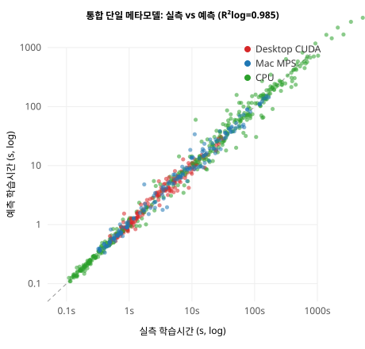

<!-- KIISE 학술발표회 양식 — 발전 초안 v2 (제출 지향)
     [1단] 제목·저자·소속·이메일·요약  /  [2단] 본문·참고문헌
     그림 명칭 하단, 표 명칭 상단. 장/절 1., 1.1. 8pt 이하 금지. 2~3쪽. -->

# (국문 제목) 이종 컴퓨팅 플랫폼을 아우르는 딥러닝 실행시간 예측 메타모델

**저자**: 〈저자1〉O 〈저자2〉 〈저자3〉   〈지도교수〉  <!-- O=발표자 -->
**소속**: 〈소속 국문명〉
**이메일**: {id1, id2, id3}@〈도메인〉

**Title**: A Cross-Platform Meta-Model for Predicting Deep Learning Execution Time

**Authors**: 〈Author1〉O 〈Author2〉 〈Author3〉
**Affiliation**: 〈Affiliation (English)〉

---

## 요 약

딥러닝 모델을 배포하기 전에 실행 시간을 아는 것은 아키텍처 설계와 하드웨어 선택에 중요하지만, 후보 구성이 수백 개에 이르면 모두 실행해 측정하는 것은 비현실적이다. 흔히 쓰이는 연산량(FLOPs)은 실제 시간과 잘 일치하지 않으며, 특히 **실행 플랫폼이 바뀌면 같은 모델도 성능이 수십 배까지 달라진다**. 본 논문은 6개 아키텍처 계열(ANN·CNN·ResNet·MobileNet·ViT·GAN)을 두 대의 기기, 네 개의 백엔드(x86 CPU·CUDA·Apple CPU·Apple MPS)에서 벤치마크한 698개 샘플을 구축하고, 모델 구조 피처와 하드웨어 피처를 함께 입력받는 **단일 크로스플랫폼 메타모델**을 제안한다. 하드웨어를 입력 피처로 인코딩함으로써 하나의 모델이 네 백엔드를 모두 예측하며, 5-겹 교차검증에서 학습·추론 시간의 로그 스케일 R²이 각각 0.985, 0.981에 도달하였다. 또한 피처 중요도 분석으로 실행 시간을 지배하는 요인이 연산량이 아니라 **메모리 트래픽**임을 세 이종 백엔드에서 일관되게 확인하였다.

---

## 1. 서 론

딥러닝 모델을 실제 환경에 배포하기 전에 "이 구성이 너무 느리지 않은가?", "GPU 없이도 감당 가능한가?", "이 노트북에서 몇 초나 걸릴까?"와 같은 질문에 답하려면 보통 모델을 **직접 실행**해 본다. 그러나 신경망 구조 탐색(NAS)이나 하드웨어 선택 과정에서 후보 아키텍처가 수백 개에 이르면 모두 실행해 측정하는 방식은 사실상 불가능하다.

실행 시간의 이론적 하한으로 흔히 쓰이는 부동소수점 연산 수(FLOPs)는 실제 시간과 잘 일치하지 않는다. 동일한 FLOPs를 갖는 두 모델도 메모리 접근 패턴이나 병렬 실행 효율에 따라 실행 시간이 크게 달라지기 때문이다 [3][4]. 이 문제는 **실행 플랫폼이 달라질 때** 더욱 두드러진다. 본 연구의 벤치마크에서 MobileNet의 depthwise separable 합성곱은 Apple ARM CPU에서 데스크톱 x86 CPU 대비 약 14배 느렸고, 같은 연산이 Apple GPU(MPS)에서는 CPU 대비 약 35배 가속되었다. 즉 실행 시간은 모델 구조뿐 아니라 **하드웨어 특성에 강하게 의존**한다.

기존의 실행 시간 예측 연구는 대체로 단일 플랫폼이나 특정 디바이스에 국한된다. nn-Meter [1]는 추론을 커널 단위로 분해해 엣지 디바이스별로 예측기를 따로 학습하며 CNN 계열에 집중한다. PreNeT [2]은 레이어별 피처로 학습 시간을 예측하고 미지 가속기로 일반화하나 GPU 가속기 위주이며 Apple Silicon 통합메모리 구조는 다루지 않는다. 본 논문은 모델 **구조 피처와 하드웨어 피처를 함께 입력**으로 받는 단일 메타모델을 제안하여, 디바이스별 예측기 없이 **x86 CPU·CUDA·Apple CPU·Apple MPS**를 하나의 모델로 예측한다. 기여는 다음과 같다.

- **(1) 단일 크로스플랫폼 메타모델**: 하드웨어를 입력 피처로 인코딩하여 네 개 이종 백엔드를 하나의 모델로 예측한다. 특히 기존 연구에서 잘 다루지 않은 Apple Silicon 통합메모리를 포함한다.
- **(2) 이종 플랫폼 실행 특성의 정량화**: 6개 계열을 두 기기에서 벤치마크한 698개 샘플로 플랫폼 간 실행 시간 차이(최대 수십 배)를 측정하고 그 원인을 분석한다.
- **(3) 메모리바운드의 교차 실증**: 실행 시간의 지배 요인이 FLOPs가 아니라 메모리 트래픽임을 CPU·CUDA·MPS 세 백엔드에서 데이터로 확인한다.

## 2. 관련 연구

**nn-Meter** [1]는 모델 추론을 커널 단위로 분해하고 커널별 지연을 예측하여 엣지 디바이스에서 높은 정확도를 얻었으나, 추론에 한정되고 디바이스마다 별도 예측기를 학습한다. **PreNeT** [2]은 레이어별 연산·메모리 피처로 학습 시간을 예측하고 미지 가속기로 일반화하지만 GPU 가속기 위주이다. Justus 등 [3]은 레이어별 실행 시간을 예측해 합산하는 방식을 제안하며 FLOPs와 실행 시간의 불일치를 지적하였다. Roofline 모델 [4]은 성능이 연산 능력과 메모리 대역폭 중 하나에 의해 제한되며 많은 경우 메모리 바운드임을 시사한다. 본 논문은 모델 전체 구조 피처와 하드웨어 피처를 **단일 회귀 메타모델**에 넣어 이종 플랫폼을 통합 예측하고, 메모리바운드 성질을 다양한 아키텍처와 백엔드에서 실증한다는 점에서 구별된다.

## 3. 제안 방법

### 3.1 벤치마크 데이터 수집

6개 모델 계열(ANN, CNN, ResNet, MobileNet, ViT, GAN)에 대해 하이퍼파라미터 조합으로 구성을 생성하고, 두 대의 기기에서 실행해 학습·추론 시간을 측정하였다(표 1). 측정 신뢰도를 위해 워밍업 후 **10회 반복 평균**을 사용하고, GPU(CUDA/MPS)는 매 측정마다 동기화(`synchronize()`)하여 비동기 실행 오차를 제거하였다. 데이터는 배치 단위로 디바이스 메모리에 사전 적재해 전송 오버헤드를 분리하였다. 하드웨어는 실행 시점에 자동 감지(Zero-Config)하여 피처로 기록한다.

[표 1] 벤치마크 구성 (총 698 샘플, 4개 백엔드)

| 기기 | 백엔드 | 샘플 수 |
|---|---|---:|
| Desktop (Ryzen 7 7800X3D) | x86 CPU | 218 |
| Desktop (RTX 4060 Ti) | CUDA | 160 |
| MacBook (Apple M4) | ARM CPU | 160 |
| MacBook (Apple M4, 24GB 통합메모리) | MPS | 160 |

### 3.2 플랫폼 간 실행 특성 차이

동일 모델·구성이라도 플랫폼에 따라 실행 시간이 크게 달라진다(표 2). 특히 MobileNet의 depthwise separable 합성곱은 Apple ARM CPU에서 데스크톱 CPU 대비 약 14배 느렸는데, 이는 PyTorch ARM 빌드에 MKLDNN/oneDNN 최적화가 포함되지 않은 데 기인한다. 반면 같은 연산이 MPS에서는 CPU 대비 약 35배 가속되어 정상 성능을 회복하였다. 이 관찰은 실행 시간 예측에 **하드웨어 특성을 반드시 입력으로 포함**해야 함을 뒷받침한다.

[표 2] 플랫폼 간 상대 실행시간 (계열별 대표값)

| 비교 | ANN | CNN | ResNet | MobileNet | ViT | GAN |
|---|---:|---:|---:|---:|---:|---:|
| Mac CPU / Desktop CPU | 0.9 | 1.9 | 2.5 | **14.0** | 0.8 | 0.6 |
| MPS 가속 (Mac GPU/CPU) | 0.5 | 5.1 | 7.1 | **35.0** | 2.7 | 1.7 |

### 3.3 피처 스키마

메타모델 입력은 130차원 스칼라 피처이며, 크게 **모델 구조**, **입력 데이터**, **하드웨어**, **op-level 분해**로 나뉜다. 하드웨어 피처(디바이스 종류, CPU 코어·주파수, GPU 메모리, 통합메모리 여부 등)를 입력에 포함함으로써 하나의 모델이 이종 백엔드를 구분해 예측한다. 또한 레이어 타입별 FLOPs 비율과 **연산 단위 메모리 읽기/쓰기 트래픽**(`total_op_memory_read/write`)을 피처로 두어 "같은 FLOPs라도 연산 구성에 따라 시간이 다르다"는 성질을 담는다. op-level 피처는 각 모델을 연산 단위로 분해해 계산한다.

### 3.4 메타모델 학습

타깃(학습·추론 시간)은 값의 범위가 넓어 `log1p` 변환 후 학습하고 평가 시 `expm1`로 역변환한다. 회귀 모델로 LinearRegression, RandomForest, GradientBoosting, XGBoost를 비교하고, 5-겹 교차검증으로 R²와 R²(log)를 측정한다.

## 4. 실험 결과

### 4.1 단일 크로스플랫폼 메타모델

네 백엔드의 698개 샘플 **전체를 하나의 모델**로 학습한 결과, 학습 시간 R²(log) 0.985(XGBoost), 추론 시간 R²(log) 0.981(GradientBoosting)을 얻었다. 하드웨어를 피처로 인코딩한 단일 모델이 x86 CPU·CUDA·Apple CPU·Apple MPS를 모두 예측할 수 있음을 보인다. 그림 1은 이 단일 모델의 실측 대비 예측을 백엔드별로 나타낸 것으로, 밀리초에서 수백 초에 이르는 넓은 범위에서 점들이 대각선(완벽 예측) 부근에 밀집한다.

[그림 1] 통합 단일 메타모델의 실측 대비 예측 학습시간 (698샘플, 백엔드별 색상, 대각선=완벽 예측)

### 4.2 백엔드별 예측 정확도

백엔드별로 분리 학습한 경우에도 모든 백엔드에서 R²(log) 0.97 이상을 유지하였다(표 3).

[표 3] 백엔드별 예측 정확도 (5-겹 CV, 최적 모델)

| 타깃 | 백엔드 | R² | R²(log) |
|---|---|---:|---:|
| 학습시간 | Desktop CPU | 0.915 | **0.991** |
| 학습시간 | CUDA | 0.953 | **0.979** |
| 학습시간 | Mac CPU | 0.846 | **0.991** |
| 학습시간 | **MPS** | 0.965 | **0.992** |
| 추론시간 | Desktop CPU | 0.941 | **0.987** |
| 추론시간 | CUDA | 0.961 | **0.974** |
| 추론시간 | Mac CPU | 0.874 | **0.980** |
| 추론시간 | **MPS** | 0.962 | **0.980** |

로그 스케일 R²이 원래 스케일보다 일관되게 높은 것은 밀리초 수준의 작은 값과 수백 초의 큰 값을 고르게 예측함을 의미한다.

### 4.3 피처 중요도 — 메모리바운드의 교차 실증

학습 시간 예측의 1위 피처는 **모든 백엔드에서 메모리 쓰기 트래픽**이었고, 순수 연산량(`flops`)의 기여는 미미했다(표 4).

[표 4] 학습시간 예측 상위 피처 중요도 (RandomForest)

| 순위 | Desktop CPU | CUDA | MPS |
|---:|---|---|---|
| 1 | total_op_memory_write **0.79** | total_op_memory_write **0.67** | total_op_memory_write **0.80** |
| 2 | total_op_memory_read 0.08 | total_op_memory_read 0.08 | total_op_memory_read 0.06 |
| 3 | flops_ratio_Linear 0.05 | flops_ratio_Linear 0.05 | flops_ratio_Linear 0.05 |
| `flops` | 8위 (0.003) | 6위 (0.020) | 6위 (0.009) |

세 이종 백엔드 모두에서 메모리 쓰기 트래픽이 1위(0.67~0.80)를 차지하고 연산량의 기여는 낮았다. 이는 현대 가속기의 실행 시간이 **메모리 바운드** 특성에 좌우된다는 roofline 통설 [4]과 일치하며, 이를 다양한 아키텍처와 백엔드에서 데이터로 실증한 결과이다.

## 5. 결 론

본 논문에서는 6개 아키텍처 계열을 두 기기·네 백엔드(x86 CPU·CUDA·Apple CPU·Apple MPS)에서 벤치마크하여, 실행 특성이 플랫폼에 따라 최대 수십 배 달라짐을 관찰하고, 이를 설명하기 위해 구조 피처와 하드웨어 피처를 함께 입력받는 **단일 크로스플랫폼 메타모델**을 제안하였다. 네 백엔드 전체를 하나의 모델로 학습해 학습·추론 시간을 로그 스케일 R² 0.98 이상으로 예측하였으며, 피처 중요도 분석으로 실행 시간이 FLOPs보다 **메모리 트래픽**에 지배됨을 세 백엔드에서 실증하였다. 향후 실측 피크 메모리 예측, ONNX 그래프 기반 예측, SNN(스파이킹 신경망) 확장을 통해 프레임워크·아키텍처 독립적 예측기로 발전시킬 계획이다.

## 참고 문헌

[1] L. L. Zhang, S. Han, J. Wei, N. Zheng, T. Cao, Y. Yang, Y. Liu, "nn-Meter: Towards Accurate Latency Prediction of Deep-Learning Model Inference on Diverse Edge Devices," in Proc. MobiSys, 2021.

[2] "PreNeT: Leveraging Computational Features to Predict Deep Neural Network Training Time," arXiv:2412.15519, 2024.

[3] D. Justus, J. Brennan, S. Bonner, A. S. McGough, "Predicting the Computational Cost of Deep Learning Models," in Proc. IEEE Int'l Conf. on Big Data, 2018.

[4] S. Williams, A. Waterman, D. Patterson, "Roofline: An Insightful Visual Performance Model for Multicore Architectures," Commun. ACM, vol. 52, no. 4, pp. 65–76, 2009.

[5] T. Chen, C. Guestrin, "XGBoost: A Scalable Tree Boosting System," in Proc. KDD, 2016.

[6] A. Paszke et al., "PyTorch: An Imperative Style, High-Performance Deep Learning Library," in Proc. NeurIPS, 2019.

[7] A. Dosovitskiy et al., "An Image is Worth 16x16 Words: Transformers for Image Recognition at Scale," in Proc. ICLR, 2021.
