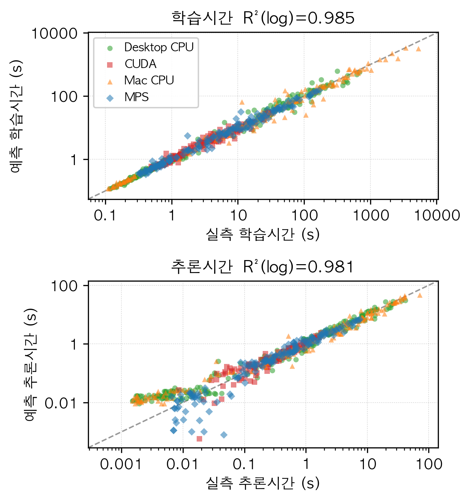

<!-- KIISE 학술발표회 양식 — 발전 초안 v3 (논문작성 원칙 적용판)
     적용: SPJ(하나의 ping·스토리) / Widom(5점 서론·반증가능 기여) /
           Gopen-Swan(강조는 문장 끝·주어동사 근접) / 정직성.
     [1단] 제목·저자·요약  /  [2단] 본문·참고문헌. 그림 하단, 표 상단. 2~3쪽. -->

# (국문 제목) 이종 컴퓨팅 플랫폼을 아우르는 딥러닝 실행시간 예측 메타모델

**저자**: 〈저자1〉O 〈저자2〉 〈저자3〉   〈지도교수〉  <!-- O=발표자 -->
**소속**: 〈소속 국문명〉
**이메일**: {id1, id2, id3}@〈도메인〉

**Title**: A Cross-Platform Meta-Model for Predicting Deep Learning Execution Time

**Authors**: 〈Author1〉O 〈Author2〉 〈Author3〉
**Affiliation**: 〈Affiliation (English)〉

---

## 요 약

<!-- SPJ: 문제 → 흥미 → 달성(예측+외삽) → 함의 -->
딥러닝 모델을 배포하기 전에 실행 시간을 알려면 보통 모델을 직접 실행해 측정하지만, 후보 구성이 수백 개에 이르면 이 방식은 불가능하다. 문제는 실행 시간이 모델 구조뿐 아니라 실행 플랫폼에 강하게 의존한다는 점으로, 실제로 본 연구의 벤치마크에서 같은 MobileNet이 Apple ARM CPU에서는 데스크톱 CPU보다 14배 느렸다. 본 논문은 모델 구조 피처와 하드웨어 피처를 함께 입력받는 단일 메타모델을 제안한다. 두 기기·네 백엔드(x86 CPU·CUDA·Apple CPU·Apple MPS)의 698개 벤치마크로 학습한 이 모델은 디바이스별 예측기 없이 5-겹 교차검증에서 학습·추론 시간을 R²(log) 0.985와 0.981로 예측하며, 학습에 없던 계열도 연산 구성이 유사한 계열이 존재하면 R²(log) 0.61~0.89로 외삽한다. 나아가 피처 중요도와 permutation 검증은 실행 시간의 가장 일관된 예측 인자가 연산량(FLOPs)이 아니라 메모리 쓰기 트래픽임을 네 백엔드 모두에서 보인다.

---

## 1. 서 론

<!-- 원칙: 구체적 사건으로 독자를 먼저 낚는다 (reader-first, MobileNet 관통 예시) -->
같은 딥러닝 모델도 어디서 실행하느냐에 따라 성능이 크게 달라진다. 본 연구의 벤치마크에서 MobileNet [1]의 depthwise separable 합성곱은 Apple ARM CPU에서 데스크톱 x86 CPU보다 약 14배 느렸고, 같은 연산이 Apple GPU(MPS)로 옮기자 CPU 대비 약 35배 빨라졌다. 이처럼 실행 시간은 모델 구조만이 아니라 하드웨어 특성에 의해 결정된다.

<!-- Widom 5점: (1) 문제 -->
딥러닝 모델을 배포하기 전에 "이 구성이 너무 느리지 않은가", "GPU 없이 감당되는가"에 답하려면 보통 모델을 직접 실행해 측정한다. 그러나 신경망 구조 탐색(NAS)이나 하드웨어 선택에서 후보가 수백 개에 이르면, 모두 실행해 측정하는 방식은 현실적으로 불가능하다.

<!-- (2) 왜 중요 / (3) 왜 어려운가 -->
실행 시간을 구조만으로 추정할 수 있다면 설계·배포 의사결정을 크게 앞당길 수 있다. 흔히 쓰이는 지표인 부동소수점 연산 수(FLOPs)는 그러나 실제 시간과 잘 맞지 않는다. 동일한 FLOPs를 갖는 두 모델도 메모리 접근 패턴과 병렬 실행 효율에 따라 실행 시간이 달라지기 때문이다 [2][3].

<!-- (4) 왜 아직 안 풀렸나 (관련연구, 인정-먼저 톤) -->
기존의 실행 시간 예측 연구는 이 문제를 부분적으로만 다룬다. nn-Meter [4]는 모델을 커널 단위로 분해하여 엣지 디바이스에서 높은 추론 지연 예측 정확도를 달성했으나, 추론에 한정되고 디바이스마다 별도의 예측기를 학습한다. PreNeT [5]은 레이어별 피처로 학습 시간을 예측하고 미지의 가속기로 일반화하지만, 대상이 GPU 가속기에 머문다. 즉 다양한 아키텍처와 이종 하드웨어를, 특히 Apple Silicon의 통합메모리 구조까지 하나로 다루는 예측기는 아직 없다.

<!-- (5) 내 접근·기여 (반증가능 + forward reference) -->
본 논문은 모델 구조 피처와 하드웨어 피처를 함께 입력받는 단일 메타모델을 제안한다. 하드웨어를 입력 피처로 인코딩함으로써, 하나의 모델이 네 개 이종 백엔드를 모두 예측한다. 본 논문의 기여는 다음과 같다.

- **단일 크로스플랫폼 메타모델**: 네 백엔드의 데이터를 하나의 모델로 학습해 학습·추론 시간을 R²(log) 0.98 이상으로 예측한다(§4.1). 기존 연구가 다루지 않은 Apple Silicon 통합메모리를 포함한다.
- **이종 플랫폼 실행 특성의 정량화**: 6개 계열을 두 기기·네 백엔드에서 벤치마크한 698개 샘플로 플랫폼 간 실행 시간 차이가 최대 수십 배에 이르는 것을 확인한다(§3.2).
- **메모리 트래픽 우위의 교차 검증**: 실행 시간의 가장 일관된 예측 인자가 FLOPs가 아니라 메모리 쓰기 트래픽임을 x86 CPU·ARM CPU·CUDA·MPS 네 백엔드 모두에서 확인한다(§4.3).

## 2. 관련 연구

<!-- 인정-먼저 톤. 짧게 (서론에서 이미 다룸) -->
Justus 등 [2]은 레이어별 시간 예측으로 FLOPs와 실행 시간의 불일치를 지적했고, Roofline 모델 [3]은 많은 워크로드가 메모리 바운드임을 시사한다. nn-Meter [4]와 PreNeT [5]은 커널·레이어 단위 예측에서 성과를 거두었다(§1). 본 논문은 모델 전체 구조 피처와 하드웨어 피처를 단일 회귀 메타모델에 통합해 이종 플랫폼을 함께 예측한다는 점에서 구별된다.

## 3. 제안 방법

### 3.1 벤치마크 데이터 수집

6개 모델 계열(ANN, CNN, ResNet, MobileNet, ViT [6], GAN)의 하이퍼파라미터 조합을 PyTorch [7] 기반으로 두 기기에서 실행해 학습·추론 시간을 측정하였다(표 1). 모든 구성은 MNIST/CIFAR-10 기반의 프로토타입 규모 아키텍처이며, 통제된 벤치마크 환경에서 수집되었다. 학습시간은 학습셋 전체 1 에폭, 추론시간은 테스트셋 전체(1만 샘플)의 순전파 벽시계 시간이다. 배치 크기는 CPU 64, GPU 128로 기기에 따라 다르지만, 두 시간 모두 동일한 샘플 수를 처리하는 시간이므로 플랫폼 간 비교가 성립하며, 배치 크기는 기기 설정의 일부로 보아 입력 피처에 포함한다. GAN은 적대적 학습 1 에폭을 학습시간으로, 생성자 순전파를 추론시간으로 정의한다. 측정의 신뢰도는 세 가지 프로토콜로 확보한다. 첫째, 워밍업 이후 10회 반복의 평균을 사용한다. 둘째, GPU(CUDA/MPS)는 매 측정마다 동기화하여 비동기 실행에 의한 오차를 제거한다. 셋째, 데이터를 배치 단위로 디바이스 메모리에 사전 적재해 전송 오버헤드를 분리한다. 하드웨어 정보는 실행 시점에 자동 감지하여 피처로 기록한다.

[표 1] 벤치마크 구성 (총 698 샘플, 4개 백엔드. Desktop CPU는 160개 구성에 58개 구성의 반복 측정을 포함)

| 기기 | 백엔드 | 샘플 수 |
|---|---|---:|
| Desktop (Ryzen 7 7800X3D) | x86 CPU | 218 |
| Desktop (RTX 4060 Ti) | CUDA | 160 |
| MacBook (Apple M4) | ARM CPU | 160 |
| MacBook (Apple M4, 24GB 통합메모리) | MPS | 160 |

### 3.2 플랫폼 간 실행 특성 차이

같은 모델·구성이라도 플랫폼에 따라 실행 시간이 크게 달라진다(표 2). 서론에서 언급한 MobileNet의 14배 지연은, PyTorch ARM 빌드에 MKLDNN/oneDNN 최적화가 빠져 depthwise 합성곱이 느리게 수행되기 때문이다. 반면 같은 연산을 MPS에서 실행하면 CPU 대비 35배 빨라진다. 반대로 가장 작은 ANN 계열에서는 MPS가 CPU보다 오히려 2배 느린데(표 2의 0.5), 연산 자체보다 커널 실행 오버헤드가 시간을 지배하기 때문이다. 두 관찰이 뜻하는 바는 같다. 실행 시간 예측은 하드웨어 특성을 반드시 입력으로 포함해야 한다.

[표 2] 플랫폼 간 상대 학습시간 (동일 구성 쌍의 시간 비를 계열별로 평균. 값>1은 1행에서는 Mac CPU가 느림을, 2행에서는 MPS가 빠름을 뜻함)

| 비교 | ANN | CNN | ResNet | MobileNet | ViT | GAN |
|---|---:|---:|---:|---:|---:|---:|
| Mac CPU 시간 / Desktop CPU 시간 | 0.9 | 1.9 | 2.5 | **14.0** | 0.8 | 0.6 |
| MPS 가속 (Mac CPU 시간 / MPS 시간) | 0.5 | 5.1 | 7.1 | **35.0** | 2.7 | 1.7 |

### 3.3 피처 스키마

메타모델의 입력은 130차원 스칼라 피처이며, 모델 구조·입력 데이터·하드웨어·op-level 분해의 네 범주로 구성된다. 하드웨어 범주는 디바이스 종류, CPU 코어·주파수, GPU 메모리, 통합메모리 여부 등을 담아, 하나의 모델이 이종 백엔드를 구분하도록 한다. op-level 범주는 각 모델을 연산 단위로 분해해 레이어 타입별 FLOPs 비율과 연산 단위 메모리 읽기·쓰기 트래픽(`total_op_memory_read/write`)을 계산한다. 여기서 read는 각 연산의 입력·가중치 바이트, write는 출력 바이트를 forward hook으로 합산한 값이다. 이 op-level 피처가 "같은 FLOPs라도 연산 구성에 따라 시간이 다르다"는 성질을 포착한다.

### 3.4 메타모델 학습

타깃인 학습·추론 시간은 값의 범위가 넓어 `log1p` 변환 후 학습하고, 평가 시 `expm1`로 역변환한다. 회귀 모델로 LinearRegression, RandomForest, GradientBoosting, XGBoost [8]를 비교하며, 성능은 5-겹 교차검증의 R²와 R²(log)로 측정한다.

## 4. 실험 결과

### 4.1 단일 크로스플랫폼 메타모델

네 백엔드의 698개 샘플 전체를 하나의 모델로 학습한 결과, 학습 시간은 R²(log) 0.985(XGBoost), 추론 시간은 0.981(GradientBoosting)로 예측되었다. 하드웨어를 피처로 인코딩한 단일 모델이 x86 CPU·CUDA·Apple CPU·Apple MPS를 모두 예측할 수 있음을 이 결과가 보인다. 그림 1은 이 단일 모델의 5-겹 CV 예측을 네 백엔드별로 나타낸 것으로, 학습시간은 0.1초에서 5,000초, 추론시간은 밀리초에서 수십 초에 이르는 넓은 범위에서 점들이 완벽 예측선 부근에 모인다. 다만 10ms 미만의 극소 추론시간 구간에서는 예측이 평탄해지는 한계도 관찰된다.

[그림 1] 통합 단일 메타모델의 실측 대비 예측 (상: 학습시간, 하: 추론시간). 축은 로그 스케일(초), 색·모양은 네 백엔드, 점선은 완벽 예측(y=x). 698개 샘플의 5-겹 CV 예측.

이 정확도가 유사 구성의 train/test 중복에 따른 낙관이 아닌지 확인하기 위해, 동일 구성의 네 백엔드 측정을 같은 폴드에 묶는 구성 단위 GroupKFold를 수행하였다(표 3). 학습에 없는 구성에 대해서도 R²(log) 0.989·0.980으로 무작위 분할과 차이가 없다. 같은 표의 기준선 비교는 두 피처 범주의 기여를 분리해 보여준다. 기기에서 유래하는 피처 27개(하드웨어 사양 전부와, 기기가 결정하는 배치 크기)를 제거하면 0.794·0.685로 떨어지는데, 같은 구조라도 백엔드에 따라 시간이 달라지는 정보를 잃기 때문이다. FLOPs 단독은 0.403·0.202에 그쳐, FLOPs가 실행 시간의 대리 지표로 불충분하다는 서론의 전제를 데이터로 뒷받침한다.

[표 3] 검증 프로토콜·피처 기준선 (통합 모델, XGBoost, R²(log))

| 설정 | 학습시간 | 추론시간 |
|---|---:|---:|
| 전체 피처, random 5-fold | 0.985 | 0.979 |
| 전체 피처, 구성 단위 GroupKFold | **0.989** | **0.980** |
| 기기 유래 피처 27개 제외 (구성 단위) | 0.794 | 0.685 |
| FLOPs 단독 (구성 단위) | 0.403 | 0.202 |
| 파라미터 수 단독 (구성 단위) | −0.121 | 0.036 |

### 4.2 백엔드별 예측 정확도

백엔드별로 분리해 학습한 경우에도 정확도는 유지된다(표 4). 모든 백엔드에서 R²(log)이 0.97 이상이다. 주목할 점은 통합 모델(§4.1의 0.985/0.981)이 백엔드별 분리 모델과 동등한 정확도를 보인다는 것으로, 네 개의 예측기를 하나로 합쳐도 정확도 손실이 없음을 뜻한다. 로그 스케일 R²이 원래 스케일보다 높은 것은, 밀리초 수준의 작은 값과 수백 초의 큰 값을 모두 고르게 예측함을 뜻한다. Mac CPU의 원 스케일 R²(0.846/0.874)이 상대적으로 낮은 것은 MobileNet 구성의 극단적 학습 시간(최대 약 5,300초)이 원 스케일 오차를 지배하기 때문이며, 로그 스케일에서는 0.98 이상으로 균일하다.

[표 4] 백엔드별 예측 정확도 (5-겹 CV, 최적 모델)

| 백엔드 | 학습 R² | 학습 R²(log) | 추론 R² | 추론 R²(log) |
|---|---:|---:|---:|---:|
| Desktop CPU | 0.915 | **0.991** | 0.941 | **0.987** |
| CUDA | 0.953 | **0.979** | 0.961 | **0.974** |
| Mac CPU | 0.846 | **0.991** | 0.874 | **0.980** |
| MPS | 0.965 | **0.992** | 0.962 | **0.980** |

### 4.3 피처 중요도 — 메모리 트래픽의 일관된 우위

학습 시간을 가장 잘 설명한 피처는, 네 백엔드 모두에서 메모리 쓰기 트래픽이었다(표 5). 순수 연산량(`flops`)의 기여는 미미했다. 이 순위가 트리 불순도 지표의 인위적 결과가 아님은 permutation 검증으로 확인하였다. 홀드아웃 데이터에서 `total_op_memory_write`를 무작위로 섞으면 R²(log)이 0.16~0.76 하락하는 반면, `flops`를 섞었을 때의 하락은 네 백엔드 모두 0.006 이하다. 다만 메모리 트래픽 피처를 제거해도 정확도 하락은 0.011 이하인데, 이 피처가 모델 구조로부터 계산되는 파생값이어서 다른 구조 피처가 대체할 수 있기 때문이다. 즉 메모리 트래픽은 유일한 정보가 아니라, 상관된 여러 피처 중 모델이 네 백엔드에서 일관되게 선택하는 가장 직접적인 실행 시간 요약이다. 이 관찰은 현대 가속기의 실행 시간이 메모리 바운드 특성에 좌우된다는 roofline 모델 [3]의 예측과 부합한다. 다만 이는 예측 모델의 피처 의존을 본 것이므로, 실행 병목이 실제로 메모리 대역폭이라는 인과적 결론에는 arithmetic intensity와 실효 대역폭의 직접 측정이 추가로 필요하다. 한편 Mac CPU에서는 합성곱 파라미터 수(conv_params)가 2위로 올라서는데, 이는 ARM CPU의 depthwise 합성곱 병목(§3.2)과 부합하는 결과다.

[표 5] 학습시간 예측 상위 피처 중요도 (RandomForest). mem_write/read는 total_op_memory_write/read의 약칭.

| 백엔드 | 1위 | 2위 | 3위 | `flops` 순위 |
|---|---|---|---|---|
| Desktop CPU | mem_write **0.79** | mem_read 0.08 | flops_ratio_Linear 0.05 | 8위 (0.003) |
| CUDA | mem_write **0.67** | mem_read 0.08 | flops_ratio_Linear 0.05 | 6위 (0.020) |
| Mac CPU | mem_write **0.46** | conv_params 0.23 | avg_width 0.07 | 12위 (0.009) |
| MPS | mem_write **0.80** | mem_read 0.06 | flops_ratio_Linear 0.05 | 6위 (0.009) |

### 4.4 미지 계열로의 외삽 성능

한 계열을 통째로 제외하고 나머지 다섯 계열로 학습해 제외 계열을 예측하는 leave-one-family-out 실험으로, 학습에 없던 아키텍처로의 외삽을 검증하였다(표 6). 합성곱 계열(CNN·ResNet·MobileNet)과 ViT는 R²(log) 0.61~0.89로 예측되지만, 유일한 순수 완전연결 구조인 ANN과 유일한 적대적 학습 계열인 GAN은 실패한다(음수 R²). 즉 연산 구성이 유사한 계열이 학습 데이터에 있을 때만 구조 피처 기반 외삽이 성립하며, 새 계열 예측에는 유사 계열의 소량 데이터 확보가 전제된다.

[표 6] 미지 계열 외삽 성능 (leave-one-family-out, 통합 모델, XGBoost)

| R²(log) | ANN | CNN | ResNet | MobileNet | ViT | GAN |
|---|---:|---:|---:|---:|---:|---:|
| 학습시간 | <0 | 0.61 | 0.88 | 0.71 | 0.67 | <0 |
| 추론시간 | <0 | 0.85 | 0.89 | 0.88 | 0.83 | <0 |

기기·백엔드 차원도 같다. 데스크톱 두 백엔드로 학습해 MacBook 두 백엔드를 예측하면 R²(log) 0.77·0.83으로 부분 성립하지만 역방향은 실패하고(0.06·−0.12), 백엔드 하나를 제외하면 CPU 계열 0.81~0.92, MPS 0.55~0.62, CUDA는 실패한다. 결국 특성이 유사한 백엔드가 학습에 있을 때만 외삽이 성립하므로, 본 모델의 하드웨어 일반화는 외삽보다 보간에 가깝고, 미지 기기 예측에는 유사 기기 데이터가 전제된다.

<!-- 정직성: 한계를 솔직히 -->
다만 본 연구에는 한계가 있다. 메모리 사용량 타깃은 데이터에서 파라미터 메모리(`total_params×4`)로 정의되어 구조로부터 결정적이므로, 예측이 자명해 성능 지표에서 제외하였다. 또한 본 벤치마크는 프로토타입 규모 아키텍처의 통제된 측정이므로, 대규모 실배포 모델과 더 다양한 기기로의 일반화는 향후 과제로 남는다.

## 5. 결 론

본 논문은 6개 아키텍처 계열을 두 기기·네 백엔드에서 벤치마크하여, 실행 특성이 플랫폼에 따라 최대 수십 배 달라짐을 보이고, 이를 설명하기 위해 구조 피처와 하드웨어 피처를 함께 입력받는 단일 크로스플랫폼 메타모델을 제안하였다. 네 백엔드 전체를 하나의 모델로 학습해 학습·추론 시간을 R²(log) 0.98 이상으로 예측하였으며(구성 단위 분할에서도 동일), 실행 시간의 가장 일관된 예측 인자가 FLOPs가 아니라 메모리 쓰기 트래픽임을 네 백엔드에서 확인하였다. 나아가 학습에 없던 계열도 연산 구성이 유사한 계열이 학습 데이터에 있으면 R²(log) 0.61~0.89로 외삽 가능함을 확인하였다. 향후 실측 피크 메모리 예측, ONNX 그래프 기반 예측, 그리고 SNN(스파이킹 신경망)으로의 확장을 계획한다.

## 참고 문헌

[1] A. G. Howard et al., "MobileNets: Efficient Convolutional Neural Networks for Mobile Vision Applications," arXiv:1704.04861, 2017.

[2] D. Justus, J. Brennan, S. Bonner, A. S. McGough, "Predicting the Computational Cost of Deep Learning Models," in Proc. IEEE Int'l Conf. on Big Data, pp. 3873–3882, 2018.

[3] S. Williams, A. Waterman, D. Patterson, "Roofline: An Insightful Visual Performance Model for Multicore Architectures," Commun. ACM, vol. 52, no. 4, pp. 65–76, 2009.

[4] L. L. Zhang, S. Han, J. Wei, N. Zheng, T. Cao, Y. Yang, Y. Liu, "nn-Meter: Towards Accurate Latency Prediction of Deep-Learning Model Inference on Diverse Edge Devices," in Proc. MobiSys, pp. 81–93, 2021.

[5] A. Pourali, A. Boukani, H. Khazaei, "PreNeT: Leveraging Computational Features to Predict Deep Neural Network Training Time," in Proc. ACM/SPEC Int'l Conf. on Performance Engineering (ICPE), pp. 81–91, 2025.

[6] A. Dosovitskiy et al., "An Image is Worth 16x16 Words: Transformers for Image Recognition at Scale," in Proc. ICLR, 2021.

[7] A. Paszke et al., "PyTorch: An Imperative Style, High-Performance Deep Learning Library," in Proc. NeurIPS, pp. 8026–8037, 2019.

[8] T. Chen, C. Guestrin, "XGBoost: A Scalable Tree Boosting System," in Proc. KDD, pp. 785–794, 2016.
