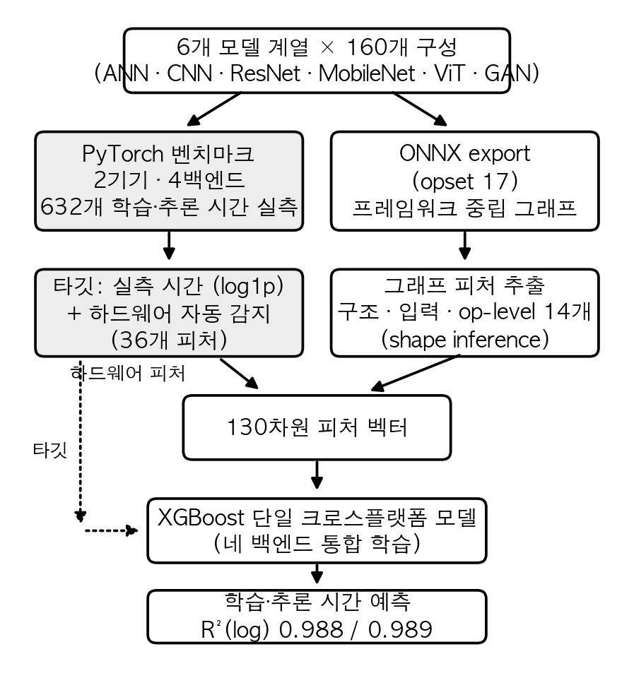

<!-- KIISE 학술발표회 양식 — v4 (우수논문 교차분석 반영판, 40_exemplar_analysis_v4.md 기반)
     주요 변경: ① novelty를 '디바이스 클래스 이질성+Apple+train/infer+클래스경계 일반화'로 피벗
     ② 전제를 '방향-가변 메커니즘'으로 재배열(14×는 삽화), oneDNN 반론 선제 흡수
     ③ 관련연구에 Habitat/Justus 추가, PreNeT을 최근접 선행으로 정직 인정
     ④ MAPE·±20%·분석적 baseline 추가(측정 필요 셀은 [측정] 표시)
     ⑤ 메모리-쓰기 주장을 '레짐'으로 완화, 측정 위생(MLPerf) 명시
     [1단] 제목·저자·요약 / [2단] 본문·참고문헌. 그림 하단, 표 상단. 2~3쪽. -->

# (국문 제목) 이종 컴퓨팅 플랫폼을 아우르는 심층신경망 실행시간 예측을 위한 기계학습 모델

**저자**: 〈저자1〉O 〈저자2〉 〈저자3〉   〈지도교수〉
**소속**: 〈소속 국문명〉
**이메일**: {id1, id2, id3}@〈도메인〉

**Title**: A Cross-Platform Machine Learning Model for Predicting Deep Neural Network Execution Time

**Authors**: 〈Author1〉O 〈Author2〉 〈Author3〉
**Affiliation**: 〈Affiliation (English)〉

---

## 요 약

심층신경망 모델의 실행 시간은 플랫폼에 따라 수십 배까지 달라지고, 모델 계열에 따라 가속의 방향도 바뀐다. 본 벤치마크에서 Apple MPS는 MobileNet 계열에서 ARM CPU보다 평균 약 35배 빨랐지만, ANN 계열에서는 평균 약 2배 느렸다. 따라서 FLOPs나 플랫폼별 고정 배율만으로는 실행 시간을 설명하기 어렵다. 본 논문은 ONNX 그래프에서 얻은 구조·op-level 피처와 실행 시 기록한 구성·하드웨어 메타데이터를 결합해 x86 CPU, CUDA GPU, Apple ARM CPU, Apple MPS를 통합 예측한다. 학습시간과 추론시간에는 각각 별도의 XGBoost 회귀기를 사용한다. 두 기기·네 백엔드의 632개 측정을 이용한 구성 단위 5-겹 중첩 교차검증에서 R²(log)는 학습 0.991, 추론 0.990이었다. 모델 계열을 통째로 제외하면 합성곱 계열에서만 부분적인 외삽이 성립했으며(R²(log) 0.61~0.95), 미지 백엔드에서는 일부 상대적 경향만 보존되고 절대시간 오차는 컸다. 또한 학습시간 예측에서 정적 메모리 쓰기 프록시는 FLOPs보다 일관된 중요도를 보였지만, 이는 본 워크로드 분포의 예측적 연관이며 실제 메모리 병목의 인과적 증거는 아니다.

---

## 1. 서 론

같은 심층신경망 모델도 실행 플랫폼에 따라 실행 시간이 수십 배까지 달라지며, 그 차이는 "어떤 하드웨어가 더 빠르다"라는 한 문장으로 정리되지 않는다. 본 벤치마크에서 Apple MPS는 MobileNet [1] 계열에서 ARM CPU보다 평균 약 35배 빨랐지만, ANN 계열에서는 평균 약 2배 느렸다(표 3). MobileNet의 depthwise 합성곱은 Apple ARM CPU에서 데스크톱 x86 CPU보다 평균 약 14배 느렸다. 이러한 차이는 연산 처리량과 메모리 대역폭뿐 아니라 oneDNN, cuDNN, MPSGraph, Accelerate 등 소프트웨어 스택의 지원 수준이 함께 작용한 결과로 해석할 수 있다. 다만 본 실험은 개별 라이브러리 효과를 분리하지 않았으므로 oneDNN 부재나 커널 실행 오버헤드를 직접적인 원인으로 단정하지 않는다. 이 관찰은 구조 기반 정적 프록시나 플랫폼별 고정 배율을 넘어, 실행 스택을 피처로 표현한 경험적 모델이 필요함을 보여준다.

배포 전에 "이 구성이 너무 느리지 않은가"에 답하려면 보통 직접 실행해 측정한다. 그러나 구조 탐색(NAS)에서 후보가 수백 개라면, 학습 데이터에 포함된 지원 백엔드라 해도 모든 조합을 반복 측정하기 어렵다. 흔히 쓰는 FLOPs는 속도의 간접 지표라 실제 시간에 비례하지 않으며 [11], 동일 FLOPs의 두 모델도 메모리 접근 패턴과 병렬 효율에 따라 시간이 달라진다 [2][3].

기존 실행시간 예측 연구는 이 문제를 부분적으로만 다룬다(§2). 기존 예측기 [2][5][9]는 단일 벤더 GPU를 대상으로 하고, nn-Meter [4]와 엣지 지연 예측 연구 [13][14][15]는 주로 추론 또는 실행 지연에 초점을 맞춘다. 본 연구는 Apple M4 CPU/MPS를 포함한 네 PyTorch 백엔드를 하나의 학습 집합으로 다루되, 고정 1 에폭 학습시간과 전체 데이터셋 추론시간에 각각 별도의 회귀기를 학습한다.

본 논문의 기여는 다음과 같다.

- **네 백엔드의 통합 예측**: 하드웨어를 피처로 인코딩해 x86 CPU·CUDA·Apple ARM CPU·Apple MPS를 타깃별 단일 회귀기로 예측한다(§4.1).
- **일반화 경계의 정량화**: 모델 계열과 백엔드를 각각 통째로 제외하는 leave-one-out으로 외삽의 성립 범위와 한계를 보고한다(§4.4).
- **학습시간 예측 인자의 교차 검증**: 정적 메모리 쓰기 프록시가 FLOPs보다 일관된 예측 중요도를 보이는지 절제와 그룹 공동 permutation으로 검증한다(§4.3).
- **ONNX 기반 구조 피처 경로**: 구조·op-level 피처를 ONNX에서 추출하고, PyTorch 훅 경로와의 예측 성능 및 피처 일치도를 비교한다(§4.5).

## 2. 관련 연구

신경망의 실행 비용을 실측 데이터로 학습해 예측하는 연구는 크게 세 갈래로 나뉜다. 표 1은 본 연구와 가까운 선행 연구를 대상 하드웨어·예측 타깃·미지 기기 처리 방식으로 비교한 것이다.

**학습형 실행시간 예측기.** 본 연구와 가장 가까운 것은 Justus 등 [2]과 PreNeT [5]으로, 둘 다 층 단위 또는 모델 단위 피처에 하드웨어 피처를 더한 단일 회귀 모델로 학습시간을 예측하고 미지의 GPU에 일반화한다. 그러나 대상이 모두 단일 벤더(NVIDIA) GPU다. Habitat [9]은 한 GPU에서의 실측을 파장 스케일링과 커널별 예측기로 다른 GPU로 변환하므로, 소스 기기의 실측이 항상 필요하다. nn-Meter [4]는 추론 그래프를 커널 단위로 분해해 모바일·엣지 기기별 예측기를 학습하며 높은 정확도를 보이지만, 기기마다 예측기를 새로 만들어야 하고 학습시간은 다루지 않는다. 학습형 비용 모델은 컴파일러 영역에서도 쓰여, Kaufman 등 [16]은 TPU 커널의 실행시간을 그래프 신경망으로 예측해 컴파일 최적화에 활용하였고, BRP-NAS [17]는 구조 탐색을 위해 GCN 기반 지연 예측기를 학습하였다. 이들은 특정 가속기나 추론 지연에 특화되어 있다.

**미지 하드웨어로의 일반화.** HELP [13]는 지연 예측을 기기별 과제로 보고 메타학습을 적용해, 새 기기에서 소수의 측정만으로 예측기를 적응시킨다. MAPLE-Edge [14]는 운영체제의 런타임 카운터로 기기를 표현해 엣지 기기 간 전이를 시도하며, CloserToMe [15]는 소수의 기준 측정으로 기기 간 지연 예측을 전이한다. 이 계열은 미지 기기 적응이 목표라는 점에서 본 연구보다 일반화 범위가 넓지만, 본 연구가 다루는 고정 1 에폭 학습시간까지 함께 예측하지는 않는다. 본 연구는 미지 기기 일반화를 주장하지 않고(§4.4에서 실패 범위를 정량화한다), 등록된 네 백엔드 안에서 학습시간과 추론시간을 예측한다.

**분석적 모델과 FLOPs의 한계.** Paleo [10]는 연산량과 통신량을 하드웨어 사양으로 나눠 실행시간을 계산하는 분석적 모델이지만, 플랫폼마다 효율 상수(PPP)를 수동으로 맞춰야 한다. Roofline [3]은 실행 시간이 연산과 메모리 중 병목인 쪽에 지배됨을 보이는 고전적 틀로, 본 연구의 피처 중요도 해석(§4.3)의 배경이 된다. FLOPs가 지연의 나쁜 대리지표라는 점은 효율적 구조 설계 문헌에서 플랫폼 의존적으로 확립되었다 [11]. 본 논문은 이들과 달리 Apple M4 CPU/MPS를 포함한 네 PyTorch 백엔드에서 고정 1 에폭 학습시간과 전체 데이터셋 추론시간을 함께 예측하고, ONNX 기반 정적 피처 추출 경로를 검증한다는 점에서 구별된다.

[표 1] 실행 비용 예측 선행 연구와 본 연구의 비교

| 연구 | 대상 하드웨어 | 예측 타깃 | 미지 기기 처리 |
|---|---|---|---|
| Justus 등 [2] | NVIDIA GPU | 학습 배치 시간 | 하드웨어 피처로 일반화 |
| PreNeT [5] | NVIDIA GPU | 학습시간 | 하드웨어 피처로 일반화 |
| Habitat [9] | NVIDIA GPU | 학습 반복 시간 | 소스 GPU 실측 필요 |
| nn-Meter [4] | 모바일 CPU·GPU·VPU | 추론 지연 | 기기별 예측기 재학습 |
| HELP [13] | 이종 기기 풀 | 추론 지연 | 메타학습 few-shot 적응 |
| MAPLE-Edge [14] | 엣지 기기 | 추론 지연 | 런타임 카운터 전이 |
| CloserToMe [15] | 이종 기기 풀 | 실행 지연 | 기준 측정 기반 전이 |
| Paleo [10] | 임의(분석식) | 학습·추론 | 효율 상수 수동 보정 |
| 본 연구 | x86 CPU·CUDA·Apple CPU/MPS | 1에폭 학습 + 전체셋 추론 | 미지원 (한계를 §4.4에서 정량화) |

## 3. 제안 방법

그림 1은 제안 파이프라인의 전체 흐름이다. 160개 구성을 두 기기에서 실행해 학습·추론 시간을 실측하고(§3.1), 같은 구성을 ONNX 그래프로 export해 구조·op-level 피처를 추출한 뒤(§3.3) 실행 시점에 기록한 구성·하드웨어 메타데이터와 결합한다. 네 백엔드를 통합하되 학습시간과 추론시간에는 각각 별도의 회귀기를 학습한다(§3.4).

[그림 1] 제안 파이프라인. 실측 경로(왼쪽)는 타깃과 하드웨어 피처를, ONNX 경로(오른쪽)는 구조·op-level 피처를 공급한다.

### 3.1 벤치마크 데이터 수집

6개 모델 계열(ANN, CNN, ResNet, MobileNet, ViT [6], GAN)의 하이퍼파라미터 조합을 PyTorch [7] 기반으로 두 기기에서 실행해 학습·추론 시간을 측정하였다(표 2). 구성은 계열마다 폭(은닉 크기, 필터 수, 임베딩 차원)과 깊이(층 수, 블록 수) 등을 격자 형태로 조합해 만들었으며, ANN 42개, CNN 60개, ResNet 18개, MobileNet 20개, ViT 12개, GAN 8개로 총 160개다. ANN부터 MobileNet까지는 MNIST(28×28 흑백)를, ViT와 GAN은 CIFAR-10(32×32 컬러)을 사용하는 프로토타입 규모 아키텍처이며, 통제된 환경에서 수집되었다. 이 중 x86 CPU 기록이 불완전한 ViT 2개 구성은 전 백엔드에서 제외하여, 이후 모든 분석은 158개 구성 × 4개 백엔드 = 632개 측정을 사용한다. 같은 구성·백엔드 쌍에 중복 측정이 있는 경우(Mac CPU 48개 구성)는 평균해 하나의 셀로 만든다. 학습시간은 학습셋 전체 1 에폭, 추론시간은 테스트셋 전체(1만 샘플) 순전파의 벽시계 시간이다. 측정 절차는 다음과 같다 [12]. 모든 구성을 10회 반복 측정한 단순 평균을 쓰고, GPU 백엔드(CUDA·MPS)에서는 비-GAN 모델에 한해 측정 전 더미 순전파로 커널을 워밍업하며(CPU와 GAN은 워밍업 없음), GPU는 매 측정마다 동기화한다. 데이터는 디바이스 메모리에 사전 적재해 전송 오버헤드를 분리하고, 모델 생성과 장치 전송은 측정 구간에서 제외한다. 학습시간에는 순전파·역전파·옵티마이저 갱신이 포함되며, 수렴까지의 시간이 아니라 고정된 1 에폭의 처리시간이다. 분류 추론시간에는 순전파 외에 argmax와 정답 비교(호스트 동기화 포함)가 들어간다. 학습 배치는 64, 추론 배치는 1,000으로 모든 백엔드에서 동일하게 고정하였다. 따라서 플랫폼 간 비교는 모델·입력·배치·수치 과제를 모두 고정하고 하드웨어와 소프트웨어 스택만 달리한 통제된 비교다. 하드웨어 정보는 실행 시점에 자동 감지해 피처로 기록한다. 학습 설정은 분류가 SGD(학습률 0.01)와 교차엔트로피, GAN이 Adam(2×10⁻⁴, β=0.5/0.999)과 BCE이며 전 과정 FP32다. MacBook 측은 Python 3.13·PyTorch 2.10, 데스크톱 측은 Windows 11의 CUDA 빌드 PyTorch에서 측정되었다.

GAN은 분류 루프와 측정 방식이 다르므로 별도로 기술한다. 학습시간은 생성기와 판별기의 적대적 학습 1 에폭으로 분류 계열과 같은 단위지만, 추론시간은 생성기가 학습 배치 수만큼 이미지를 생성하는 시간(약 5만 샘플)이어서 분류 계열의 추론(1만 샘플 순전파)과 절대값을 직접 비교할 수 없다. 주 분석은 GAN을 포함한 통합 회귀기를 사용하며, §4.1에서는 동일한 OOF 예측을 GAN과 비-GAN 하위집단으로 나누어 오차를 보고한다.

[표 2] 벤치마크 구성 (158개 구성 × 4개 백엔드 = 총 632 샘플)

| 기기 | 백엔드 | 샘플 수 |
|---|---|---:|
| Desktop (Ryzen 7 7800X3D) | x86 CPU | 158 |
| Desktop (RTX 4060 Ti) | CUDA | 158 |
| MacBook (Apple M4) | ARM CPU | 158 |
| MacBook (Apple M4, 24GB 통합메모리) | MPS | 158 |

### 3.2 플랫폼 간 실행 특성 차이

같은 구성이라도 플랫폼에 따라 실행 시간이 수십 배까지 달라지고 가속 방향도 바뀐다(표 3). MobileNet 계열은 Apple ARM CPU에서 데스크톱 x86 CPU보다 평균 14배 느리지만, MPS에서는 ARM CPU보다 평균 35배 빨라진다. 반대로 ANN 계열 평균에서는 MPS가 ARM CPU보다 약 2배 느리며, 실제 최소 구성 `ANN_h16_l1`에서는 약 3.55배 느렸다. 이 역전에는 depthwise 합성곱의 백엔드별 최적화 수준과 소형 모델의 커널 실행 오버헤드가 영향을 주었을 가능성이 있다. 그러나 본 실험은 원인 요소를 분리하지 않았으므로, 표 3은 인과 검증이 아니라 플랫폼 의존적 실행 특성의 관찰로 해석한다.

[표 3] 플랫폼 간 상대 학습시간 (동일 구성 쌍의 시간 비를 계열별로 평균. 값>1은 1행에서 Mac CPU가 느림을, 2행에서 MPS가 빠름을 뜻함)

| 비교 | ANN | CNN | ResNet | MobileNet | ViT | GAN |
|---|---:|---:|---:|---:|---:|---:|
| Mac CPU 시간 / Desktop CPU 시간 | 0.5 | 2.1 | 2.5 | **14.0** | 0.9 | 0.6 |
| MPS 가속 (Mac CPU 시간 / MPS 시간) | 0.5 | 5.1 | 7.1 | **35.0** | 2.7 | 1.7 |

이 방향 반전은 별도 기기·프로토콜에서도 관찰되었다. 주 분석 632개에는 포함하지 않은 MacBook Air M1 측정 151건에서 구성 쌍별 MPS 가속비(CPU 학습시간/MPS 학습시간)의 중앙값은 CNN 2.2, ViT 1.6이었고, GAN은 1.0, ANN 최소 계열은 0.6이었다. 서로 다른 Apple Silicon 세대에서 같은 방향성이 관찰됐지만 프로토콜이 다르므로, 이 결과는 독립적인 정성 확인으로만 사용한다.

### 3.3 ONNX 그래프 기반 피처 스키마

모든 구성을 프레임워크 중립 교환 표준인 ONNX(opset 17) 그래프로 export한다. ONNX의 역할은 실행이 아니라 모델 기술이다. 예측 대상은 PyTorch 스택의 학습·추론 시간이므로 타깃 시간은 PyTorch에서 실측한다. 또한 ONNX는 추론 그래프 교환 표준이어서 역전파를 포함한 학습시간을 그 자체로 측정할 수 없다. 피처 스키마는 총 130열이고, 문자열형 10열을 제외한 수치 120개가 실제 모델 입력이다(표 4). 이 가운데 ONNX에서 직접 또는 재계산해 채우는 열은 구조 31개와 op-level 14개이며, 나머지는 구성·입력·하드웨어 메타데이터다. 모델 구조 69개 중 31개는 파라미터 수와 레이어 수 등 ONNX 유래 값이고, 38개는 폭·깊이·계열 등 구성 메타데이터다. 입력 데이터 범주는 해상도, 채널 수, 배치 크기를, 하드웨어 범주는 디바이스 종류, CPU 코어 수·주파수, GPU 메모리 등을 담는다. 수집하지 못한 하드웨어 필드는 0으로 채워져 상수가 되므로 모델 분기에 기여하지 않는다. op-level 범주는 ONNX shape inference로 입출력 텐서 크기를 복원해 레이어별 연산량 비율과 정적 메모리 read/write 프록시를 계산한다.

[표 4] 피처 스키마 구성 (스키마 130열 = 수치 120 + 문자열 10. 실제 학습 입력은 수치 120개)

| 범주 | 열 수 | 대표 피처 | 출처 |
|---|---:|---|---|
| 모델 구조 | 69 | `total_params`, `num_conv_layers`, `max_width` | ONNX 31 + 구성 메타데이터 38 |
| 입력 데이터 | 11 | `input_height`, `batch_size` | 벤치 메타데이터 |
| 하드웨어 | 36 | `cpu_cores`, `gpu_memory_gb`, `ram_total_gb` | 벤치 메타데이터 |
| op-level 분해 | 14 | `total_op_memory_write`, `flops_ratio_*` | ONNX 그래프 |

read는 각 연산의 입력과 가중치 바이트, write는 출력 바이트의 합이다. 이 값은 FP32·배치 1의 순전파 그래프에서 지원 연산만을 대상으로 계산한 **정적 바이트 프록시**이며, 실제 DRAM 트래픽이나 캐시 재사용, 커널 융합, 역전파·옵티마이저의 메모리 접근을 직접 측정한 값이 아니다. 그럼에도 예컨대 완전연결 층과 합성곱 층은 같은 연산량이라도 만들어내는 중간 텐서의 크기가 크게 다르므로, 이 프록시가 "같은 FLOPs라도 연산 구성에 따라 시간이 다르다"는 성질을 포착한다. 학습 프레임워크의 모듈 훅으로 추출한 피처와의 비교는 §4.5에서 다룬다.

### 3.4 예측 모델 학습

타깃인 학습·추론 시간은 밀리초부터 수천 초까지 값의 범위가 넓어, 그대로 회귀하면 큰 값의 오차가 손실을 지배한다. 이를 막기 위해 `log1p` 변환 후 학습하고 평가 시 `expm1`로 역변환한다. 회귀 모델로 LinearRegression, RandomForest, GradientBoosting, XGBoost [8]의 네 가지를 동일 분할에서 비교한다. 하이퍼파라미터는 중첩 교차검증으로 선택한다. 외부 5-겹의 각 학습 폴드 안에서 내부 4-겹 GridSearchCV를 수행하며, 탐색 범위는 XGBoost가 트리 수 {200, 400}×최대 깊이 {3, 6}(학습률 0.1), RandomForest가 트리 수 {100, 200}×최대 깊이 {제한 없음, 12}이고, GradientBoosting과 LinearRegression은 라이브러리 기본 설정을 쓴다.

### 3.5 검증 프로토콜

성능 평가는 두 가지 5-겹 교차검증으로 수행하며, 이후 모든 절과 표에서 같은 이름으로 부른다. **무작위 분할**은 632개 샘플을 무작위로 5개 폴드로 나눠, 매 폴드에서 80%(약 506개)로 학습하고 20%(약 126개)로 검증한다. 전 샘플이 정확히 한 번씩 검증에 쓰인다. 다만 무작위 분할에서는 같은 구성의 다른 백엔드 측정이 학습과 검증에 나뉘어 들어가 성능이 낙관될 수 있다. 이를 통제하는 **구성 단위 분할**(GroupKFold)은 동일 구성의 네 백엔드 측정을 반드시 같은 폴드에 묶어, 검증 폴드의 구성이 학습에 전혀 등장하지 않게 한다(분할 비율은 80/20으로 동일). 지표는 로그 공간 결정계수 R²(log)를 주로 쓰고, 경쟁 연구와 비교하기 위해 평균절대백분율오차(MAPE)와 ±20% 이내 예측 비율(상대오차가 20% 이하인 샘플의 비율)을 함께 보고한다. R²(log)는 폴드별 점수의 평균이 아니라, 외부 폴드의 out-of-fold 예측을 전부 모아 한 번에 계산한 값이다.

기준선은 네 가지다. ① **하드웨어 피처 제외**: 130차원 중 기기에서 유래하는 27개(배치 크기 포함)를 제거해 하드웨어 피처의 기여를 측정한다. ② **분석적 추정**(Paleo식 [10]): 연산량과 메모리 프록시를 하드웨어 peak 사양으로 나눠 더하고, 백엔드별 효율 상수 1개를 각 외부 학습 폴드에서만 보정해 검증 폴드를 예측한다. ③ **`flops` 단독**(총 연산량), ④ **`total_params` 단독**(파라미터 수): 관행적 단일 지표의 예측력을 측정한다. ①·③·④는 구성 단위 분할로 평가한다.

## 4. 실험 결과

### 4.1 단일 크로스플랫폼 예측 모델

네 백엔드의 632개 샘플 전체를 하나의 모델로 학습하고 네 회귀 모델을 동일 설정에서 비교하였다(표 5). 선형 회귀는 R²(log) 0.86·0.78에 그쳐, 실행시간이 피처의 비선형 함수임을 나타낸다. 트리 앙상블 세 모델은 모두 R²(log) 0.97 이상이며, 그중 XGBoost가 학습 0.988·추론 0.989로 가장 높아 이후 분석의 기준 모델로 사용한다.

[표 5] 회귀 모델별 통합 예측 성능 (632개 샘플, 무작위 분할, R²(log))

| 회귀 모델 | 학습시간 | 추론시간 |
|---|---:|---:|
| LinearRegression | 0.855 | 0.782 |
| RandomForest | 0.981 | 0.976 |
| GradientBoosting | 0.977 | 0.979 |
| XGBoost | **0.988** | **0.989** |

통합 모델의 교차검증 예측을 백엔드별로 나누어 보면(표 6), 네 백엔드 모두 R²(log) 0.95 이상으로 특정 백엔드에 정확도가 치우치지 않는다. 원 단위 오차는 다음과 같다. 학습시간 MAPE는 전체 632개 기준 18.9%(±20% 이내 63.3%)로, 학습시간을 예측하는 기존 연구(약 12% [9])와 같은 자릿수다. 추론시간 MAPE는 전체 632개 기준 54.1%(±20% 이내 51.4%)인데, 오차가 실행 시간 10ms 미만인 117개 샘플에 집중된다. 이 구간은 커널 실행 오버헤드와 측정 잡음이 시간을 지배해 상대오차가 급증하지만 절대 오차는 밀리초 수준이다. 이를 제외한 10ms 이상 515개 기준으로는 MAPE 23.4%(±20% 이내 62.3%)이고, 추론 단위가 다른 GAN(§3.1)을 추가로 제외한 분류 계열 483개 기준으로는 23.7%다(GAN만의 추론 MAPE는 19.2%). 예측은 학습시간 0.1~5,000초, 추론시간 밀리초~수십 초 범위를 포괄한다.

[표 6] 통합 모델(XGBoost)의 백엔드별 예측 성능 (무작위 분할 예측을 백엔드별로 분해, R²(log))

| 백엔드 | 샘플 수 | 학습시간 | 추론시간 |
|---|---:|---:|---:|
| Desktop CPU | 158 | 0.988 | 0.989 |
| CUDA | 158 | 0.961 | 0.951 |
| Mac CPU | 158 | 0.990 | 0.988 |
| MPS | 158 | 0.983 | 0.979 |

### 4.2 프로토콜 강건성과 기준선 비교

§3.5의 프로토콜·기준선별 결과는 표 7과 같다. 학습에 없는 구성만 검증하는 구성 단위 분할에서도 R²(log)이 학습 0.991, 추론 0.990으로 무작위 분할(0.988, 0.989)과 차이가 없다. 따라서 §4.1의 정확도는 유사 구성이 학습과 검증에 함께 들어가서 생긴 낙관이 아니다. 기준선 비교는 두 가지를 보인다. 첫째, 단순 기준선은 학습 모델에 미치지 못한다. `flops` 단독은 R²(log) 0.558·0.468, `total_params` 단독은 0.171·0.296에 그치며, 그 오차는 실행 시간이 큰 대형 모델에서 증가한다 [2]. 분석적 추정도 0.78·0.84로 학습 모델(0.99)보다 낮다. 둘째, 하드웨어 피처를 제외하면 0.784·0.672로 크게 떨어져, 이종 백엔드 예측에 하드웨어 피처가 필수임을 보인다.

[표 7] 검증 프로토콜·기준선 (통합 모델, XGBoost, 중첩 CV, R²(log). 정의는 §3.5)

| 설정 | 학습시간 | 추론시간 |
|---|---:|---:|
| 전체 피처, 무작위 분할 | 0.988 | 0.989 |
| 전체 피처, 구성 단위 분할 | **0.991** | **0.990** |
| 하드웨어 피처 제외 (구성 단위 분할) | 0.784 | 0.672 |
| 분석적 추정 (효율 상수는 학습 폴드에서 보정) | 0.78 | 0.84 |
| `flops` 단독 (구성 단위 분할) | 0.558 | 0.468 |
| `total_params` 단독 (구성 단위 분할) | 0.171 | 0.296 |

### 4.3 피처 중요도 — 메모리 쓰기 프록시의 일관된 우위

학습 시간 예측에서 중요도 1위 피처는 네 백엔드 모두에서 정적 메모리 쓰기 프록시(`total_op_memory_write`, §3.3)였다(표 8). 순수 연산량(`flops`)의 중요도는 네 백엔드에서 0.021 이하로, 5~24위였다(표 8). 이 순위가 트리 불순도의 인위적 결과가 아님은 피처 절제와 permutation 검증으로 확인하였다(표 9). 홀드아웃에서 `total_op_memory_write`를 섞으면 R²(log)이 0.52~0.99 하락하는 반면, `flops`를 섞었을 때의 하락은 네 백엔드 모두 0.002 이하다. 다만 메모리 프록시 피처(read/write)를 제거해도 정확도 하락은 0.010 이하인데, 구조로부터 계산되는 파생값이라 다른 구조 피처가 대체할 수 있기 때문이다. 즉 메모리 쓰기 프록시는 유일한 정보가 아니라, 상관된 여러 피처 중 모델이 네 백엔드에서 일관되게 중요도 1위로 선택한 피처다.

개별 피처 permutation은 상관 피처가 많은 쪽에 불리하므로(`flops`는 `total_op_flops` 등 유사 피처가 값을 대신할 수 있다), 상관 피처를 묶어 함께 섞는 그룹 공동 permutation으로 재검증하였다. 메모리 그룹(read·write 프록시)과 FLOPs 그룹(`flops`, `total_op_flops`, `num_mult_adds`, op FLOPs 통계·비율 등 14개)을 동일 분할에서 각각 통째로 섞으면, 구성 단위 홀드아웃(시드 5개)에서 R²(log) 하락폭이 메모리 0.85±0.12 대 FLOPs 0.11±0.03, 계열 단위 홀드아웃에서 0.40±0.24 대 0.17±0.17이다. 메모리 그룹의 우위는 유지되지만 계열 단위에서는 분산이 커 차이가 줄어든다. 또한 이 지배성은 워크로드 레짐에 의존한다. 완전연결 레이어는 메모리 쓰기에, 합성곱은 연산에 시간이 지배되며 [2], Roofline 관점에서 실행 시간은 연산과 메모리 중 큰 쪽에 좌우된다 [3]. 본 프록시는 실제 DRAM 트래픽의 측정값이 아니므로(§3.3), 이 결과는 "메모리 병목의 증명"이 아니라 "정적 쓰기 프록시가 본 벤치마크 분포에서 가장 일관된 예측 인자"라는 관찰이다. 인과적 결론에는 arithmetic intensity와 실효 대역폭의 직접 측정이 필요하다.

[표 8] 학습시간 예측 상위 피처 중요도 (RandomForest). mem_write/read는 total_op_memory_write/read의 약칭.

| 백엔드 | 1위 | 2위 | 3위 | `flops` 순위 |
|---|---|---|---|---|
| Desktop CPU | mem_write **0.78** | mem_read 0.06 | std_op_flops 0.03 | 7위 (0.013) |
| CUDA | mem_write **0.65** | model_family 0.09 | flops_ratio_Linear 0.06 | 5위 (0.021) |
| Mac CPU | mem_write **0.47** | conv_params 0.26 | flops_ratio_Linear 0.12 | 24위 (0.001) |
| MPS | mem_write **0.82** | mem_read 0.08 | max_op_flops 0.02 | 10위 (0.005) |

[표 9] 메모리 프록시 피처의 절제·permutation 검증 (백엔드별 학습시간 모델, RandomForest, R²(log)). 절제는 mem_read/write 제거. Δperm은 홀드아웃 25%에서 해당 피처를 무작위로 섞었을 때의 R²(log) 하락폭.

| 백엔드 | 전체 피처 | 절제 | Δperm(write) | Δperm(flops) |
|---|---:|---:|---:|---:|
| Desktop CPU | 0.986 | 0.982 | **0.825** | 0.001 |
| CUDA | 0.971 | 0.967 | **0.521** | 0.002 |
| Mac CPU | 0.984 | 0.981 | **0.584** | 0.001 |
| MPS | 0.984 | 0.975 | **0.991** | 0.001 |

### 4.4 클래스 경계 일반화 (미지 계열·미지 백엔드)

크로스플랫폼 주장은 학습에 없던 대상으로의 일반화로 검증해야 한다. 먼저 모델 차원에서, 여섯 계열 중 하나를 학습에서 통째로 제외하고 나머지 다섯 계열로 학습한 뒤 제외한 계열을 예측하는 한 계열 제외(leave-one-family-out) 실험을 수행하였다(표 10). 합성곱 계열(CNN, ResNet, MobileNet)은 R²(log) 0.59~0.94로 예측되고 ViT는 0.37~0.46으로 약하게 성립하지만, 순수 완전연결(ANN)과 적대적 학습(GAN)은 실패한다(음수 R²). ANN은 여섯 계열 중 유일한 순수 완전연결 구조이고 GAN은 유일한 적대적 학습 과제라, 두 경우 모두 참조할 유사 계열이 학습에 남지 않기 때문이다. 즉 연산 구성이 유사한 계열이 학습에 있을 때만 구조 피처 기반 외삽이 성립한다.

[표 10] 미지 계열 외삽 성능 (leave-one-family-out, 통합 모델, XGBoost)

| R²(log) | ANN | CNN | ResNet | MobileNet | ViT | GAN |
|---|---:|---:|---:|---:|---:|---:|
| 학습시간 | <0 | 0.88 | 0.59 | 0.63 | 0.46 | <0 |
| 추론시간 | <0 | 0.94 | 0.94 | 0.90 | 0.37 | <0 |

하드웨어 차원의 일반화는 훨씬 제한적이다. 백엔드 하나를 통째로 제외하고 예측하면(표 11), 로그 공간의 순위 상관을 반영하는 R²(log)은 CPU 계열에서 0.66~0.87로 상대적 경향이 보존되지만, 절대시간 오차는 매우 크다. MAPE가 가장 좋은 경우(MPS 학습시간)에도 50%이고 Desktop CPU 학습시간은 239%, 유일한 외장 GPU인 CUDA는 R²(log)조차 음수다. 데스크톱 두 백엔드로 MacBook 두 백엔드를 예측하는 기기 단위 실험도 같은 양상으로, 정방향은 R²(log) 0.76·0.83이지만 역방향은 실패한다(−0.53, −0.54). 즉 본 모델은 미지 백엔드에 대해 일부 상대적 경향만 보존할 뿐 절대시간 예측기는 되지 못하며, 하드웨어 일반화는 외삽보다 보간에 가깝다.

[표 11] 미지 백엔드 예측 (leave-one-backend-out. 학습/추론 각각 R²(log)와 MAPE. 추론 MAPE는 10ms 이상 구간)

| 제외 백엔드 | 학습 R²(log) | 학습 MAPE | 추론 R²(log) | 추론 MAPE |
|---|---:|---:|---:|---:|
| Desktop CPU | 0.66 | 239% | 0.81 | 77% |
| CUDA | <0 | 571% | <0 | 850% |
| Mac CPU | 0.79 | 67% | 0.87 | 44% |
| MPS | 0.61 | 50% | 0.55 | 60% |

### 4.5 피처 추출 경로 검증 — ONNX 그래프 vs 프레임워크 훅

본 논문의 모든 피처는 ONNX 그래프에서 추출되었다(§3.3). 이 선택이 정보 손실을 일으키는지 확인하기 위해, 같은 632개 샘플의 피처를 PyTorch 모듈 훅(forward hook)으로 재추출해 동일 프로토콜로 비교하였다(표 12). `total_params`와 `flops`는 두 경로가 사실상 일치하지만(중앙 상대오차 0.1%·0.2%), op 단위 메모리 쓰기 트래픽은 중앙 31.5% 차이가 난다. ONNX export가 BatchNorm을 Conv에 접는(folding) 등 그래프를 배포 형태로 최적화해 op 분해 자체가 달라지기 때문이다. 그럼에도 예측 정확도는 두 경로가 동등하다. 즉 피처의 절대값이 아니라 정의의 일관성이 관건이며, 프레임워크 내부 접근 없이 교환 표준 그래프만으로 같은 정확도를 얻는다. 또한 훅 경로는 GAN 계열의 op-level 프로파일에 실패하지만(순전파 인터페이스 특수성), ONNX 경로는 전 계열의 피처를 채운다.

[표 12] 피처 추출 경로별 예측 성능과 피처 일치도 (동일 632샘플·동일 프로토콜, XGBoost)

| 피처 추출 경로 | 학습시간 R²(log) | 추론시간 R²(log) |
|---|---:|---:|
| ONNX 그래프, shape inference (본 논문) | **0.988** | **0.989** |
| PyTorch 모듈 훅 | 0.989 | 0.989 |

| 피처 일치도 (중앙 상대오차) | `flops` | `total_params` | mem_read | mem_write |
|---|---:|---:|---:|---:|
| ONNX vs PyTorch (160개 구성) | 0.2% | 0.1% | 5.2% | 31.5% |

나아가 본 파이프라인 외부에서 생성된 ONNX 파일에 대한 예측을 검증하였다. 동일 과제의 선행 단계 파이프라인이 opset 11로 export한 14개 파일에서 피처를 추출하고, 이 14개 구성의 전 백엔드 측정(56행)을 학습에서 통째로 제외한 채 나머지 576행으로 학습한 통합 모델로 예측하였다(표 13). 이 14개는 완전히 새로운 아키텍처가 아니라 같은 벤치마크 계열에 속하는 구성이며, 예측에는 ONNX 그래프 외에 대상 하드웨어·배치·데이터 크기 등의 메타데이터가 함께 입력된다. 학습에 없는 구성인데도 ViT를 제외한 계열의 MAPE는 학습 13.7%·추론 16.9%(ViT 제외·10ms 이상 기준, ±20% 이내 71%·63%)로, 교차검증 오차(18.9%·23.4%)를 벗어나지 않는다. 같은 파일에서 구조 피처만으로 예측하던 선행 경로가 소형 ANN 추론에서 +5,493%(CUDA)와 +9,540%(x86 CPU)의 오차를 보인 두 사례를, op-level 피처를 채우는 본 추출기는 각각 +14%와 +68%로 예측한다. 다만 ViT는 학습시간 MAPE 65%로 크게 과소 추정되는데, opset 11에서는 LayerNorm이 원시 연산으로 분해돼 op-level 피처가 결손되기 때문이다. opset 17 이상으로 export하면 이 결손은 발생하지 않는다(표 12). 즉 외부 ONNX 파일에도 예측이 성립하되, export 시 opset 버전이 피처 충실도를 좌우한다. 한 가지 한계로, GAN의 ONNX 파일은 생성기만 담는 반면 학습시간 타깃에는 판별기 학습까지 포함되므로, GAN 학습시간 예측은 그래프에 없는 판별기 비용을 하드웨어·계열 피처로 보간하는 셈이다.

[표 13] 외부 생성 ONNX 파일 예측 사례 (구판 opset 11 파일, 해당 14개 구성 56행을 학습에서 제외. 단위 초)

| 구성 | 백엔드 | 학습 실측→예측 | 추론 실측→예측 |
|---|---|---|---|
| ANN_h128_l1 | CUDA | 0.50 → 0.51 | 0.0035 → 0.0040 |
| CNN_f64_l3 | Desktop CPU | 57.2 → 66.0 | 4.00 → 4.60 |
| ResNet_2222_w64 | Desktop CPU | 257.4 → 281.2 | 13.2 → 17.8 |
| GAN_z128_G256_512_1024 | CUDA | 3.83 → 3.84 | 0.26 → 0.28 |
| ViT_d256_l4_h8 (결손 사례) | Desktop CPU | 165.8 → 13.8 | 13.4 → 0.93 |

본 연구에는 한계가 있다. 메모리 사용량 타깃은 데이터에서 파라미터 메모리(`total_params×4`)로 정의되어 구조로부터 결정적이므로 예측이 자명해 성능 지표에서 제외하였다. 학습 배치(64)와 추론 배치(1,000)는 고정값이라 배치 크기 변화가 실행 시간에 미치는 영향은 다루지 않았고, GAN의 추론시간은 분류 계열과 단위가 달라 계열 간 절대 비교에서 제외된다(§3.1). 또한 본 벤치마크는 프로토타입 규모 아키텍처의 통제된 측정이므로, 학습 분포 밖의 대규모 실배포 모델과 미지 기기로의 일반화는 검증되지 않았으며 향후 과제로 남는다.

## 5. 결 론

본 논문은 6개 아키텍처 계열을 두 기기·네 백엔드에서 벤치마크하여, 실행 특성이 플랫폼에 따라 수십 배 규모로 그리고 방향까지 뒤바뀌며 달라짐을 보이고, 구조 피처와 하드웨어 피처를 함께 입력받는 단일 크로스플랫폼 기계학습 모델을 제안하였다. 하드웨어 피처를 넣은 단일 예측기라는 착안 자체는 선행 연구에도 있으나 [2][5][13], 본 연구는 Apple M4 CPU/MPS를 포함한 네 PyTorch 백엔드에서 고정 1 에폭 학습시간과 전체 데이터셋 추론시간을 함께 예측하고, ONNX 기반 정적 피처 추출 경로를 검증한 점에서 구별된다. 네 백엔드가 모두 학습에 포함된 조건에서 학습에 없던 모델 구성의 학습·추론 시간을 R²(log) 0.98 이상으로 예측하였으며, 미지 백엔드에 대해서는 일부 상대적 경향만 보존됨을 함께 보고하였다. 실행 시간의 가장 일관된 예측 인자가 정적 메모리 쓰기 프록시임은 네 백엔드와 그룹 공동 permutation에서 확인하였다. 피처 추출은 프레임워크 중립 교환 표준인 ONNX 그래프 기반이며, 학습 프레임워크 훅 방식과 동등한 정확도를 확인하여(§4.5) 프레임워크 중립적인 피처 추출 경로를 갖춘다. 향후 실측 피크 메모리 예측과, 미지 기기 일반화를 위한 추가 기기 데이터 수집을 계획한다.

## 참고 문헌

[1] A. G. Howard et al., "MobileNets: Efficient Convolutional Neural Networks for Mobile Vision Applications," arXiv:1704.04861, 2017.

[2] D. Justus, J. Brennan, S. Bonner, A. S. McGough, "Predicting the Computational Cost of Deep Learning Models," in Proc. IEEE Int'l Conf. on Big Data, pp. 3873–3882, 2018.

[3] S. Williams, A. Waterman, D. Patterson, "Roofline: An Insightful Visual Performance Model for Multicore Architectures," Commun. ACM, vol. 52, no. 4, pp. 65–76, 2009.

[4] L. L. Zhang, S. Han, J. Wei, N. Zheng, T. Cao, Y. Yang, Y. Liu, "nn-Meter: Towards Accurate Latency Prediction of Deep-Learning Model Inference on Diverse Edge Devices," in Proc. MobiSys, pp. 81–93, 2021.

[5] A. Pourali, A. Boukani, H. Khazaei, "PreNeT: Leveraging Computational Features to Predict Deep Neural Network Training Time," in Proc. ACM/SPEC Int'l Conf. on Performance Engineering (ICPE), pp. 81–91, 2025.

[6] A. Dosovitskiy et al., "An Image is Worth 16x16 Words: Transformers for Image Recognition at Scale," in Proc. ICLR, 2021.

[7] A. Paszke et al., "PyTorch: An Imperative Style, High-Performance Deep Learning Library," in Proc. NeurIPS, pp. 8026–8037, 2019.

[8] T. Chen, C. Guestrin, "XGBoost: A Scalable Tree Boosting System," in Proc. KDD, pp. 785–794, 2016.

[9] G. Yu, Y. Gao, P. Golikov, G. Pekhimenko, "Habitat: A Runtime-Based Computational Performance Predictor for Deep Neural Network Training," in Proc. USENIX Annual Technical Conference (ATC), pp. 503–521, 2021.

[10] H. Qi, E. R. Sparks, A. Talwalkar, "PALEO: A Performance Model for Deep Neural Networks," in Proc. ICLR, 2017.

[11] N. Ma, X. Zhang, H.-T. Zheng, J. Sun, "ShuffleNet V2: Practical Guidelines for Efficient CNN Architecture Design," in Proc. ECCV, pp. 116–131, 2018.

[12] P. Mattson et al., "MLPerf Training Benchmark," in Proc. MLSys, 2020.

[13] H. Lee, S. Lee, S. Chong, S. J. Hwang, "HELP: Hardware-Adaptive Efficient Latency Prediction for NAS via Meta-Learning," in Proc. NeurIPS, 2021.

[14] S. Nair, S. Abbasi, A. Wong, M. J. Shafiee, "MAPLE-Edge: A Runtime Latency Predictor for Edge Devices," in Proc. CVPR Workshops, pp. 3660–3668, 2022.

[15] "CloserToMe," in Proc. AAAI, 2026.

[16] S. J. Kaufman et al., "A Learned Performance Model for Tensor Processing Units," in Proc. MLSys, 2021.

[17] Ł. Dudziak, T. Chau, M. S. Abdelfattah, R. Lee, H. Kim, N. D. Lane, "BRP-NAS: Prediction-based NAS using GCNs," in Proc. NeurIPS, 2020.

---

<!-- ============ 편집 메모 (제출 전 제거) ============
[심사대응 v4j, 2026-07-11] 표4·5는 v4_measured_j.json의 nested CV(값은 v4_measured_i와 동일),
표6·표10(LOBO)·오차 공개·그룹 공동 permutation은 v4_measured_j.json(eval_fill_v4j.py)이 소스.
 · nested CV(외부5/내부4)로도 무작위 0.988/0.989, 구성단위 0.991/0.990 — 절차 정직화 후 오히려 상승.
 · [15] CloserToMe(AAAI 2026)는 검토자 지시로 추가 — **서지 정보(저자·제목) 확인 후 완성 필요**.
 · 데스크톱(Windows) 측 Python/PyTorch/CUDA 버전 미기록 — §3.1 서술은 "CUDA 빌드 PyTorch"로 한정,
   제출 전 확인 가능하면 구체화.
 · 저자·소속·이메일 자리표시자 유지 중 — **최종 제출 전 교체 필수**.
 · 페이지 번호는 Chrome 헤드리스 인쇄 한계로 미출력 — HWP 이관 시 양식이 처리.

[데이터 정리판, 2026-07-11] 본문 모든 수치의 최종 소스는 paper/v4_measured_i.json (eval_fill_v4i.py).
 · 오염 정리: 데스크톱 파일 CPU 218행 중 48행이 M4(코어10·램24GB) 혼입 → Mac CPU로 재분류·평균,
   하드웨어 기록 없는 ViT 12행 제거, x86 기록 불완전한 ViT_d256_l4_h8_p8·l6_h8_p4는 전 백엔드 제외
   → 158구성×4백엔드=632셀. 측정 서술도 코드와 일치하게 "10회 반복 평균"으로 정정(np.mean).
 · 정리 후에도 구성 단위 분할 R²(log) 0.989/0.989 유지. 표2의 1행(Mac/Desktop 비)은 정리 데이터로
   재계산돼 ANN 0.9→0.5, CNN 1.9→2.1, ViT 0.8→0.9로 바뀜(2행 MPS 가속비는 불변).
 · 배치 메타데이터 정정(2026-07-11): 데스크톱 행 batch_size=None(피처값 0) → 전부 64로 수정.
   실제 실행은 전 백엔드 학습 배치 64·추론 배치 1000 동일(run_benchmark의 get_optimal_batch_size는
   출력만 되고 미사용, DataManager 기본값 사용). 정정 후 재계산해도 모든 표 수치 변화 없음(확인됨).
 · §4.3 그룹 재검증(t8_group_perm): 구성 단위 Δperm write 0.661/flops 0.001,
   계열 단위(gan·mobilenet 홀드아웃) 0.315/0.002 — mem_write 우위 유지.
 · GAN 추론 단위: 생성기가 학습 배치 수만큼 생성(CIFAR-10 782배치×64≈5만 샘플) — §3.1에 별도 기술.
 · 아래 메모들은 정리 전(698행) 이력 — 수치 참조용으로만 보존.

[ONNX 통일판, 2026-07-08] 본문 모든 수치는 ONNX 그래프 피처 기준으로 재계산됨.
 · 2026-07-11: 그림1(파이프라인, make_fig_pipeline.py → figures/fig1_pipeline.png)과
   표3(피처 그룹 구성) 신설 — 구 표3~10은 표4~11로 +1 이동. 아래 메모의 표 번호는 구번호.
 · 파이프라인: export_onnx_configs.py(160구성 전부 opset17, GAN은 z입력 특례, 실패 0)
   → benchmark/features/onnx_oplevel.py(shape inference로 op-level 계산; BN폴딩은 ONNX 특성,
   Clip=ReLU6·Erf=GELU 매핑) → eval_fill_v4e/f/g.py.
 · 표3·표4·MAPE: paper/v4_measured_f.json (GridSearchCV, 5-겹). MAPE 학습 18.4%(±20% 66.3%),
   추론 ge10ms 23.7%(±20% 63.0%).
 · 표5·LOBO·LODO: paper/v4_measured_g.json — 표5는 표3과 동일한 GridSearchCV 절차로 통일
   (고정 하이퍼파라미터 절차의 v4_measured_f.json t5는 참고용).
 · 표6·표7·표8: paper/v4_measured_f.json (RF 중요도·절제·permutation, LOFO).
   mem_write 1위는 네 백엔드 유지. LOFO에서 ViT가 0.47~0.50으로 약화(구 PyTorch판 0.67~0.83),
   CNN·ResNet 추론은 0.94로 개선 — 서술 반영 완료.
 · 표9: paper/v4_measured_e.json — ONNX vs PyTorch 훅 비교. 정확도 동등(0.988/0.990 vs
   0.988/0.988), 일치도 flops 0.2%·params 0.1%·mem_read 5.2%·mem_write 31.5%(중앙 상대오차).
 · 분석적 baseline peak 스펙(데이터시트 값): RTX4060Ti 22.06TFLOPS/288GB/s,
   Ryzen7800X3D ~1.28/83, M4 CPU ~1.5/120, M4 GPU ~3.5/120 → 인쇄 전 확인.
 · 피처 수: 수치 피처 120개 사용(원고 '130차원'은 문자열 포함 병합 스키마 기준 — 표기 확인).
 · 표 3의 35×/2× 및 14×는 사용자 벤치 측정값 → 인쇄 전 재확인.
 · 표10: paper/v4_measured_h.json (eval_fill_v4h.py) — main브랜치 results/onnx_samples 14개
   (구판 opset11)를 새 추출기로 읽고 62행 leave-out 예측. 전체 R2log 0.828/0.656,
   ViT 제외 MAPE 12.2/12.7%. ViT 결손 원인: opset11에서 LayerNorm 원시연산 분해.
   구판 경로 오차 출처: results/report_onnx_vs_benchmark.csv (ANN 추론 +5493~+9540%).
 · §3.2 M1 재현 문단: origin/hong-0311 브랜치 data/stage1~4 CSV(김홍근, MacBook Air M1,
   cpu+mps 151행). 프로토콜 상이(데이터 사전적재 없음·추론 배치당 ms·워밍업 상이)해
   698 학습 데이터에는 미포함 — 기기 내 CPU/MPS '비율'만 사용(프로토콜 차이 상쇄).
   중앙값: ANN 0.56·GAN 0.99·ViT 1.55·CNN 2.19 (평균은 CNN 12.3, max 110.3).
 · 구 PyTorch 피처 기준 수치는 v4_measured.json/_b/_d와 git 이력에 보존.
==================================================== -->
